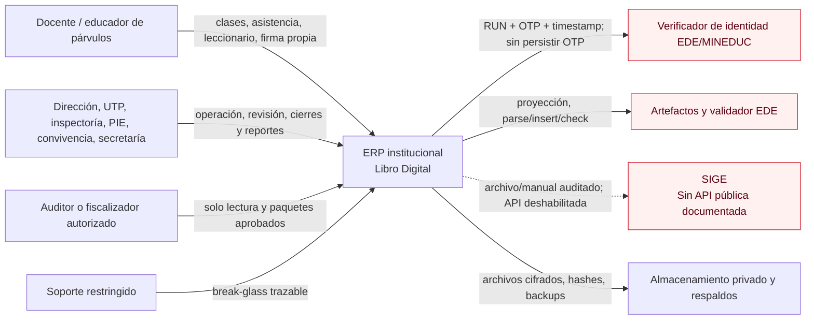
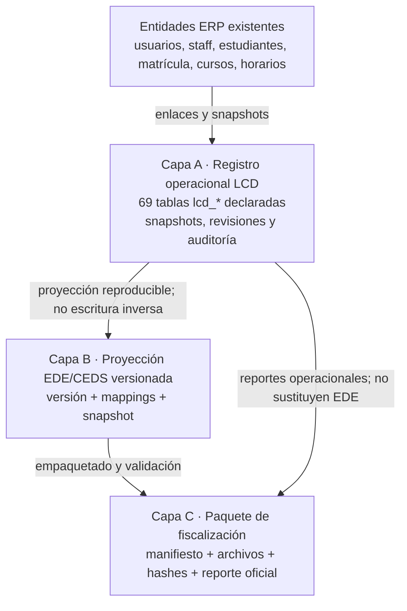
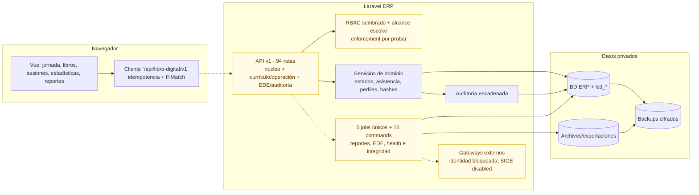
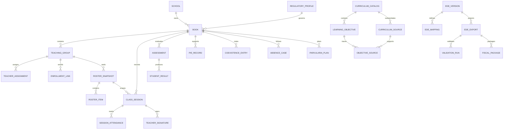

# Arquitectura del Libro Digital

## Estado y alcance

Esta arquitectura describe el objetivo del módulo y marca su nivel de implementación al 2026-08-13:

- **Implementado parcialmente:** esquema relacional `lcd_*`, modelos principales, servicios transversales y de firma, comandos operativos, seed RBAC/configuración, reportes PDF/XLSX/CSV/JSON, adjuntos privados, proyección/staging/runner EDE y componentes Vue.
- **API amplia, no liberable:** 94 rutas versionadas cubren núcleo, currículo —incluidas seis de importación/aprobación/activación—, cierres/conciliación, enmiendas, evaluaciones, PIE, convivencia, ausencias, retiros/retornos, parvularia/atrasos, EDE y auditoría por entidad. No existe todavía evidencia exhaustiva de autorización, estado, concurrencia e integración por cada ruta.
- **Implementación presente pero no habilitable:** importación local, proyector/job de exportación y runner/job asíncrono EDE están codificados, pero sin fuentes oficiales importadas, versión/digest/argv fijados, snapshot consistente probado ni corrida del validador.
- **Bloqueado por cumplimiento:** firma productiva, EDE, descarga de fiscalización, reglas finas de parvularia/asistencia y SIGE.

La presencia de una tabla, modelo o pantalla no implica que el caso de uso esté disponible. Una capacidad solo está implementada cuando existe flujo servidor autorizado, auditoría, pruebas y evidencia operacional.

## Principios arquitectónicos

1. **Integración, no aplicación paralela.** Se reutilizan usuarios, personal, estudiantes, matrículas, cursos, horarios, años académicos, convivencia, apoyo profesional y asistencia existentes.
2. **Separación en tres capas de datos.** El registro operacional no se acopla al estándar EDE ni al formato de fiscalización.
3. **Historia antes que mutabilidad.** Snapshots, revisiones y estados conservan el contexto; los registros firmados no se sobrescriben.
4. **Tenencia explícita.** Toda operación se limita por establecimiento y, cuando corresponde, por año, curso, asignatura y asignación vigente.
5. **Normativa versionada.** Las reglas se resuelven por perfil, fecha, nivel y modalidad; no se distribuyen números mágicos por el código.
6. **Interoperabilidad reproducible.** Una exportación fija fuente, versión EDE, mapeos, snapshot, manifiesto, archivos, hashes y digest del validador.
7. **Fail closed.** Si no hay perfil, credencial, validador, digest o permiso, la operación crítica no continúa.
8. **Migraciones forward-only.** Un rollback de aplicación no elimina tablas o registros oficiales.

## Contexto del sistema

El verificador, el contenedor EDE y SIGE son límites externos. Una indisponibilidad o contrato no verificado nunca se reemplaza por una contraseña local, un resultado simulado ni scraping.

## Capas de datos

Una modificación posterior a una exportación no muta el paquete anterior: crea revisión, marca exportaciones afectadas como `stale` y exige generar un paquete nuevo.

## Componentes

### Componentes existentes

| Componente | Responsabilidad | Observación |
|---|---|---|
| `FeatureFlagService` | Resolución de flags globales/escolares | Deniega por defecto si no hay configuración. |
| `CompliancePreflightService` + `lcd:preflight` | Comprueba esquema, storage, RBD, perfiles, fuentes, EDE, digest y verificador | Servicio y comando implementados; requieren ejecución/evidencia por escuela y no sustituyen los blockers. |
| `RegulatoryProfileResolver` + `RegulatoryRuleRegistry` | Selecciona perfil vigente y exige reglas verificadas | Falla cerrado sin coincidencia/regla. El seeder crea perfiles base, pero sus fuentes/reglas finas siguen bloqueadas. |
| `WorkflowStateMachine` | Valida transiciones de libro, sesión, enmienda y exportación | Enum, mapa y prueba EDE incorporan `validation_queued`; falta demostrar aplicación uniforme en controlador/jobs, reintentos y carreras. Ver [STATE_MACHINES.md](STATE_MACHINES.md). |
| `SessionAttendanceService` | Registra asistencia contra nómina sellada, valida duplicados y completitud | Mantiene la marca por sesión separada de los resolvers diario/subvención/SIGE. |
| Resolvers/cierres de asistencia | Anomalías, regla diaria versionada y cierres diarios/mensuales hashados | Hay endpoints de cierre/reconciliación y prueba de versión/reapertura; `DailyAttendanceResolver` solo opera con regla explícita y `SubsidyAttendanceResolver` siempre bloquea. Faltan reglas oficiales/UAT/motor objetivo. |
| `AmendmentService` + API | Solicitud, decisión, revisión append-only, reapertura de derivados y marcado `stale` | Controller aplica allowlists y separa solicitante/revisor/aplicador; existe prueba de sesión/cierres. Faltan todos los agregados, carreras, nueva firma real y UAT. |
| `CanonicalJson` | Normalización determinista y SHA-256 | Base para firmas, revisiones y auditoría. |
| `OptimisticLock` | Valida `If-Match`/`lock_version` | Requiere integración en cada endpoint mutable. |
| `AuditEventWriter` | Evento append-only con diff cifrado y hash encadenado por escuela | Debe invocarse en todos los casos de uso críticos. |
| `AuditIntegrityVerifier` + `lcd:audit:verify` | Recalcula cadena y detecta enlaces/hashes inválidos | Servicio/comando implementados; `RunLibroDigitalIntegrityCheck` incluye esta revisión y está agendado diariamente. Faltan evidencia de ejecución productiva, alertamiento, permisos append-only de BD y prueba en destino. |
| `TeacherSignatureService` | Prepara/firma con completitud, asignación, identidad, lock, evidencia y sello HMAC | Implementado a nivel servicio. Productivo bloqueado por credenciales/contrato/pruebas; HMAC es integridad de aplicación, no certificación. |
| Verificadores de identidad | Drivers `disabled`, `fake`, transaccional y masivo; circuito de protección | `fake` solo testing; transaccional usa `rut`, `otp`, `DateWithTimeZone`. Ninguno tiene evidencia productiva. |
| `LibroDigitalReportService` + job | Instantánea fuente cifrada/hashada y generación privada PDF/XLSX/CSV/JSON | El job verifica y consume la instantánea sellada y todos los archivos permanecen como borrador; hay descarga autenticada/expirable. Falta demostrar aislamiento consistente en el motor objetivo, especializar todos los tipos del catálogo, ampliar RBAC y hacer QA visual. |
| `PrivateAttachmentService` | MIME real, tamaño, hash, cifrado y storage privado | Servicio parcial: falta driver antivirus, endpoint/descarga autorizada y pruebas de contenido adversarial. |
| Gateways SIGE | Driver `disabled` y reconciliación manual con hash/evidencia | El modo manual nunca se marca oficial; no existe API oficial documentada ni sincronización automática habilitable. |
| `CurriculumXlsxReader` + validator/import service | Plantilla de cinco hojas, lectura OOXML endurecida, fuentes por `source_key`, relación N:M objetivo–fuente, adjuntos oficiales cifrados/hashados, manifiesto/payload, aprobación y activación con lock/SoD parcial | Seis rutas existen y la activación falla si falta evidencia vinculada. Aún no hay corpus oficial NT1–4M importado/reconciliado/UAT, allowlist de autoridad completa, fuente artística/TP detallada ni SoD aprobador–activador. |
| `EdeProjectionService` + importación | Proyección por mappings declarativos y transformaciones allowlist | Comando/API aceptan artefactos locales y hashes reales; HTTP archiva cifrado y solo deja `imported`. Las fuentes oficiales requeridas no se han importado/activado y el proyector sigue sin snapshot consistente probado. |
| `EdeExportService` + `GenerateLibroDigitalEdeExport` | Gate, deduplicación, manifest y staging cifrado | El job es `ShouldBeUnique` y produce solo candidato `generated/not_run`; no produce por sí mismo un EDE oficial validado. |
| `EdeValidatorRunner` + `ValidateLibroDigitalEdeExport` | Encola `validation_queued`; luego ejecuta argv allowlist en Docker sin red/read-only/capabilities y guarda reporte cifrado | El job es asíncrono/único; bloqueado por digest/contrato/config, no ejecutado ni contrastado con el formato oficial. Nunca corre Docker dentro de la petición web. |
| Commands LCD | 15 comandos para preflight, apertura controlada, detecciones, asistencia, EDE, auditoría, retención, health e integridad | Lecturas son no mutantes; mutaciones exigen `--execute`/aprobación. `lcd:retention:run --execute` falla cerrado y nunca borra/anonimiza. |
| Jobs y scheduler | Cinco jobs `ShouldBeUnique`; health cada 5 min, integridad 02:40, sesiones faltantes 18:15 y firmas faltantes 19:00 en días hábiles | Código presente; faltan workers/locks/alertas y evidencia real de ejecución productiva. |
| `LibroDigitalSeeder` | Fuentes/perfiles base, flags apagados, permisos/roles y navegación | Requiere revisión: no convertir fuentes sin hash en verificadas ni asignar membresía escolar por presunción. |
| Resolvers de políticas | Firma, asistencia, exportación y retención por perfil | Defaults seguros; faltan reglas oficiales importadas/aprobadas. |
| Componentes Vue | Experiencia de operación y cumplimiento | Shell/rutas existen, pero dependen de endpoints finales y la UI no constituye autorización. |

### Componentes o cierres todavía requeridos

- completar fiscalización y otros cierres administrativos pendientes, y probar las 94 rutas existentes por autorización/tenencia/workflow de extremo a extremo;
- enforcement y pruebas de todos los permisos sembrados, segregación de funciones y revisión segura de `lcd_school_users`;
- completar cobertura transaccional/concurrente para libros, sesiones, todos los tipos de enmienda/cierres y exposición API de firma;
- aprobar reglas y ampliar pruebas de `DailyAttendanceResolver`, cierres y conciliación; `SubsidyAttendanceResolver` debe seguir bloqueado hasta fuente oficial;
- ejecutar y aprobar el importador curricular con el corpus oficial completo (bytes por `source_key`, relaciones canónicas/fundamentos, conciliación 100 %, contrato NT/modalidades, pruebas, rechazo/revocación y SoD completo) y ejecutar controladamente el importador EDE con estándar/diccionario/mapeo oficiales íntegros;
- snapshot consistente, builder de entrada oficial y suite de integración para proyector/export/runner EDE;
- operación robusta de jobs/commands: colas dedicadas, idempotencia/reintentos aprobados, métricas y alertas;
- catálogo completo de builders PDF/XLSX/CSV/JSON, descargas autorizadas y control de expiración;
- generador/aprobador de paquete de fiscalización;
- gateways SIGE deshabilitado, de archivo y reconciliación manual;
- retención con legal hold; por decisión del proyecto no habrá borrado automático en producción.

## Modelo de dominio

Los nombres del diagrama son conceptuales; las tablas físicas se documentan en [DATA_DICTIONARY.md](DATA_DICTIONARY.md).

## Consistencia e integridad

### Transacciones y concurrencia

- Toda mutación compuesta se ejecuta en transacción.
- Las entidades editables usan `lock_version`; el cliente envía `If-Match` e `Idempotency-Key`.
- La asistencia bloquea la sesión antes de guardar y rechaza cambios si quedó firmada/cerrada durante la edición.
- Nóminas y cierres guardan snapshots y hashes. El proyector EDE actual hace varias consultas sin una transacción de snapshot consistente; debe corregirse antes de activarlo.
- La clave de ocurrencia y los índices únicos evitan sesiones y registros duplicados en su contexto.

### Inmutabilidad

- `lcd_audit_events` y `lcd_record_revisions` no tienen `updated_at`.
- El modelo `AuditEvent` rechaza update/delete desde Eloquent; falta reforzar permisos de BD para impedir escrituras directas.
- Los registros firmados/cerrados se modifican mediante `lcd_amendment_requests`, aprobaciones y nueva revisión.
- Las FK a historia usan `RESTRICT`; los enlaces secundarios que pueden desaparecer usan `SET NULL` sin eliminar el registro LCD.

### Tiempo

- Persistencia: UTC.
- Zona institucional: `America/Santiago` por defecto, configurable por escuela.
- Presentación: hora local de la escuela.
- Integración: RFC 3339 con offset.
- Las pruebas deben cubrir cambios de horario de verano y límites de fecha local/UTC.

## Límites de seguridad

| Límite | Riesgo principal | Control requerido |
|---|---|---|
| Navegador → Laravel | suplantación, IDOR, XSS, reintentos | sesión/CSRF, RBAC, scope escolar, ULID, validación, idempotencia, `If-Match`. |
| Laravel → verificador | filtración/replay de OTP y RUN | TLS, no logs, no retry automático, rate limit, timestamp, correlación y contrato aprobado. |
| Worker → Docker EDE | supply-chain y command injection | digest inmutable, argv allowlist, usuario sin privilegios, límites, mounts mínimos, timeout. |
| Aplicación → storage | exposición masiva de NNA | cifrado, rutas privadas, URLs temporales, autorización por descarga, hash, auditoría. |
| Escuela A → escuela B | fuga entre tenants | `school_id` obligatorio, policies/scopes, pruebas de aislamiento y consultas sin scope prohibidas. |
| Producción → respaldo | pérdida o copia no protegida | backup cifrado, claves separadas, acceso mínimo y restauración probada. |

El análisis completo está en [THREAT_MODEL.md](THREAT_MODEL.md).

## Decisiones y consecuencias

### ADR-001: migraciones forward-only

Los `down()` de las once migraciones LCD declaradas no borran tablas. Una reversión despliega código compatible y desactiva flags; los cambios de esquema se corrigen con otra migración aditiva. Consecuencia: el historial no ofrece una reversión destructiva automática, por diseño. `000009`–`000011` permanecen pendientes en la base local observada; aunque la suite efímera cubre track, identidad y trazabilidad multisource, deben migrarse/probarse en staging y motor objetivo antes de usarlos.

### ADR-002: snapshots de nómina

Cada sesión referencia una nómina sellada. Un ingreso, cambio de lista o retiro posterior no altera la asistencia histórica. Consecuencia: hay duplicación controlada de nombres/identificadores protegidos y se deben aplicar retención y cifrado a los snapshots.

### ADR-003: proyección EDE desacoplada

El estándar externo cambia sin rediseñar el núcleo operacional. El proyector declarativo y staging ya materializan esta separación; aún se requiere importar una versión oficial, tomar snapshot consistente y probar reproducibilidad/validador antes de habilitar exportación.

### ADR-004: no fallback local de firma

Si el verificador no responde, la sesión queda pendiente. Consecuencia: continuidad operacional en borrador, pero nunca una falsa firma.

### ADR-005: sin borrado automático de producción

La fecha `retention_until` sirve para reporte, archivo y revisión jurídica, no como gatillo de hard-delete. Una disposición futura requiere proceso separado, legal hold, doble autorización, evidencia y nueva decisión arquitectónica.

## Gates de producción

La arquitectura solo se considera operacional cuando se cumplan conjuntamente:

1. API y RBAC completos con aislamiento por escuela y asignación.
2. Estados/enums/defaults centrales alineados y enforcement de transiciones probado en servicios/API/concurrencia.
3. Seeders oficiales versionados sin OA/códigos inventados.
4. Cifrado de campo real verificado, no solo nombres `*_encrypted`.
5. Backup/restauración, auditoría y concurrencia probados en el motor destino.
6. DPIA y procedimientos de privacidad aprobados antes de la vigencia de Ley 21.719 el 2026-12-01.
7. Para EDE: fuente/digest/importación/proyección/validador/reporte completos.
8. Para fiscalización: aprobación de cuatro ojos y descarga privada auditada.

Mientras algún gate falte, el despliegue permanece apagado.
