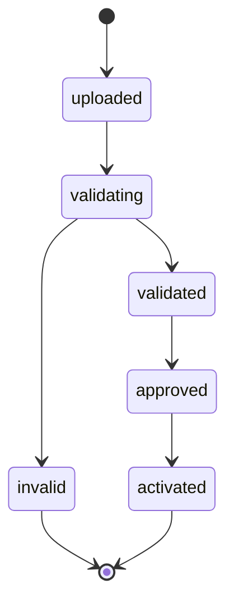
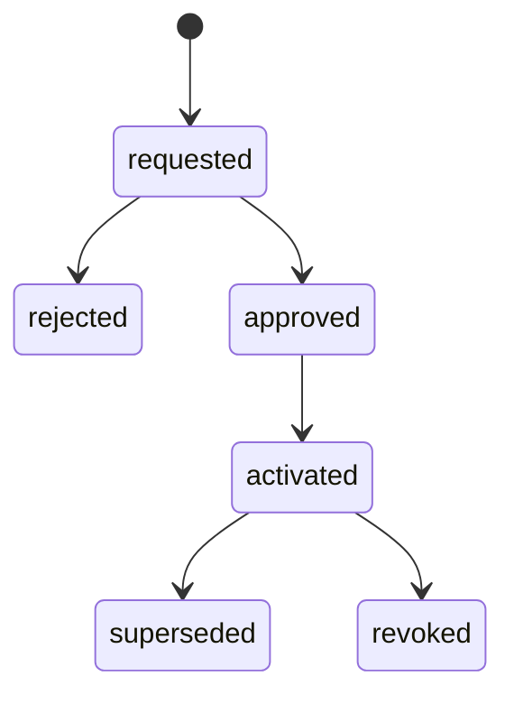

# Runbook de importación curricular XLSX

## 1. Propósito y estado

Este procedimiento define cómo preparar, validar, aprobar y activar un catálogo curricular derivado de fuentes oficiales para `NT1`, `NT2`, `1B`–`8B` y `1M`–`4M`.

> Estado técnico local al **2026-08-14**: las migraciones curriculares `000009`–`000011` figuran `Ran`; existe un lote `activated` con **6.337 objetivos** (**5.394 activos / 943 inactivos**), **6 fuentes**, **12.674 relaciones objetivo–fuente** y **4 vínculos**. El catálogo compartido contiene 129 asignaturas, de las cuales solo `MAT` y `PM` están activas por aparecer en `Vinculos` activos. El preflight local devuelve `ready=true`, `core_ready=true`, `module_enabled=true` y cero blockers core; identidad, EDE, parvularia, SIGE y fiscalización continúan apagados/no requeridos. La cadena local de auditoría fue válida sobre 6 eventos. La suite focalizada literal pasa **70 pruebas / 553 assertions**, exit code `0` (solo warning XML conocido). Esto acredita una **instalación local técnica**, no UAT, habilitación productiva ni certificación de autenticidad, vigencia o completitud normativa del corpus.

La solicitud del lote local fue registrada como sistema (`requested_by=null`), pero una misma cuenta `super_admin` aprobó y activó. El servicio implementado sí exige que el solicitante sea distinto del aprobador/activador, pero todavía permite `approver=activator`; por tanto, el flujo local no acredita la segregación recomendada de tres personas. No se debe reescribir ese historial: la excepción debe conservarse y una operación productiva futura debe usar actores separados o una excepción formal aprobada.

El XLSX es un transporte institucional revisable. No es una publicación MINEDUC ni reemplaza los bytes de la fuente.

## 2. Roles y segregación

| Actor | Responsabilidad | Restricción mínima |
|---|---|---|
| Preparador | Obtiene fuentes, genera el XLSX y manifiesto. | No aprueba ni activa su propio lote. |
| Validador técnico/curricular | Ejecuta controles, concilia textos y conteos. | No modifica el archivo validado; un cambio crea otro lote. |
| Aprobador UTP/currículo | Aprueba alcance, fuente, modalidad y relaciones de asignatura. | Debe ser distinto del preparador. |
| Activador autorizado | Ejecuta la activación atómica. | En producción debe ser distinto del preparador y del aprobador. |
| Cumplimiento/operación | Revisa evidencia y gestiona el blocker/preflight. | No puede cerrar el blocker antes de la activación y reconciliación. |

Las cuentas técnicas no sustituyen decisiones humanas. Toda excepción requiere acta; una excepción no puede omitir fuente, hash, vigencia o completitud.

## 3. Preparar la fuente

1. Confirmar el alcance real: escuela, RBD, año, niveles, modalidad y asignaturas impartidas.
2. Seleccionar la familia aplicable en [CURRICULUM_CATALOG_CONTRACT.md](CURRICULUM_CATALOG_CONTRACT.md).
3. Descargar el artefacto desde UCE/MINEDUC o BCN por un canal aprobado.
4. Registrar URL final, autoridad, título, acto, fecha de consulta, fecha del artefacto, bytes y SHA-256 calculado sobre los bytes reales.
5. Conservar el original inmutable en almacenamiento privado. No reemplazarlo por texto copiado desde un buscador.
6. Si se usa HTML, archivar una captura reproducible del contenido y sus metadatos; si se usa el JSON:API técnico, conservar respuesta, headers, paginación y hash, y reconciliar todo contra PDF/HTML.
7. Confirmar vigencia. Para 2026 no usar la priorización 2023–2025 como universo completo.

Si no se pueden obtener o verificar los bytes, detener el flujo.

## 4. Contrato XLSX ejecutable actual

`CurriculumXlsxReader`, `CurriculumImportValidator` y `CurriculumImportService` implementan lectura, validación, archivo/persistencia, aprobación y activación. El manifiesto técnico se genera después de leer/normalizar con esquema interno `lcd-curriculum-import/v1`; no existe una hoja `manifest` ni debe inventarse una `format_version` que el lector no consume. La plantilla se descarga desde `GET /api/libro-digital/v1/curriculum/imports/template`.

Artefacto de plantilla congelado en este corte: `resources/templates/libro-digital/plantilla-importacion-curriculo-nt1-4m.xlsx`, **68.596 bytes**, SHA-256 real `9e2bfd523e807c3d6f21255829d0702b4ab032046ff8c75d28dcbb2fca0db976`. Esta huella identifica la plantilla institucional, no una fuente ni objetivos MINEDUC.

El XLSX actual exige cinco hojas con al menos una fila de datos:

1. `Catalogo` o `Catalogos`;
2. `Fuentes`;
3. `Objetivos`;
4. `ObjetivoFuentes` u `Objetivo_Fuentes`;
5. `Vinculos` (se tolera la tilde por normalización ASCII).

Puede contener `Referencias`, hoy opcional y leída como valores libres. Las hojas no reconocidas se ignoran: antes de producción esto debe cambiar a rechazo explícito o allowlist verificada para que no pueda ocultarse contenido. Las hojas requeridas deben contener exactamente los encabezados siguientes; el lector rechaza encabezados adicionales en esas hojas.

### 4.1 Hoja `Catalogo`

| Columna exacta | Validación ejecutable actual | Control adicional requerido para aprobar |
|---|---|---|
| `catalog_code` | Mayúsculas; 1–100 caracteres `A-Z0-9._-`. | Debe corresponder a una unidad de catálogo aprobada en el contrato, no a un alias improvisado. |
| `catalog_name` | Obligatorio, máximo 255 caracteres. | Título verificable y alcance inequívoco. |
| `version` | Obligatoria; 1–50 caracteres alfanuméricos/punto/guion/guion bajo. | Nunca `latest`; relacionar con bytes y acto fijos. |
| `authority` | Obligatoria, máximo 160 caracteres. | Allowlist UCE/MINEDUC/BCN y revisión humana; el validador actual no aplica allowlist. |
| `source_url` | Valor legacy opcional; si existe debe ser URL HTTP/HTTPS sintácticamente válida. | No entra en `catalog_payload_hash` ni acredita procedencia; las URLs habilitantes viven por documento en `Fuentes`. |
| `source_sha256` | Valor legacy opcional; si existe debe tener 64 caracteres hexadecimales. | Se conserva como declaración resumen no habilitante, se excluye del hash portable y no sustituye hashes/evidencias por documento. |
| `effective_from` | `YYYY-MM-DD` cuando existe. | Verificar contra acto y vigencia. |
| `effective_to` | `YYYY-MM-DD`, no anterior a inicio, cuando existe. | Verificar modificaciones/derogación. |

Debe existir exactamente una fila. `file_hash`/`size_bytes` del XLSX se calculan sobre el archivo recibido; no sustituyen los hashes de `Fuentes`. El expediente conserva por separado transporte, documentos oficiales y relaciones.

### 4.2 Hoja `Fuentes`

Cada fila representa **un documento**, con una `source_key` única dentro del catálogo. Varios documentos pueden cubrir el mismo `source_scope`; DS 439/433 o DS 614/369 nunca se condensan en una fuente ficticia.

| Columna exacta | Validación ejecutable actual | Gate normativo |
|---|---|---|
| `source_key` | Obligatoria; `A-Z0-9._-`, 1–100; sin duplicados. | Identificador estable del documento; debe corresponder exactamente a la clave del archivo adjunto. |
| `source_scope` | Uno de `PARVULARIA_NT1_NT2`, `GENERAL_1B_6B`, `GENERAL_7B_2M`, `HC_3M_4M`, `TP_3M_4M`, `ARTISTICA_3M_4M`. | Agrupa cobertura; no reemplaza acto, modalidad, asignatura ni evidencia. |
| `source_name` | Obligatorio. | Título oficial verificable. |
| `authority` | Obligatoria. | Autoridad oficial allowlisted y revisada. |
| `document_number` | Obligatorio. | Acto o identificador documental exacto; no usar el nombre del catálogo como sustituto. |
| `source_url` | HTTP/HTTPS sintácticamente válida. | HTTPS oficial y URL final archivada; hoy falta allowlist técnica. |
| `source_sha256` | 64 hex; el mismo hash no puede declararse bajo dos claves. | Debe coincidir con SHA-256 calculado sobre `evidence_files[source_key]`. |
| `effective_from` / `effective_to` | ISO y orden coherente cuando existen. | Vigencia cotejada con BCN/UCE y modificaciones. |
| `curriculum_track` | Opcional; `PARVULARIA`, `GENERAL`, `HC`, `TP`, `ARTISTICA`. | Si se declara restringe la fuente al track; cada track usado debe tener fuente explícita. |
| `subject_code` | Opcional; debe existir en `ScheduleSubject`. | Si se declara restringe cobertura a esa asignatura; mapping aprobado. |
| `objective_type` | Opcional; tipo admitido por el validador. | Si se declara restringe cobertura; `OAG`/`OAC` mantienen sus gates normativos. |

`HC_3M_4M` es un nombre técnico histórico del catálogo cerrado de `source_scope`; no significa que todos sus objetivos sean de formación diferenciada HC. Sin cambiar el enum ni las migraciones, el validador admite dentro de ese scope `curriculum_track=GENERAL` para la Formación General de 3M/4M y `curriculum_track=HC` para la Formación Diferenciada Humanístico-Científica, ambas bajo las Bases aprobadas por el DS 193/2019. El XLSX debe conservar el track real de cada fuente/objetivo: está prohibido recodificar Formación General como `HC` solo para coincidir con el nombre del scope o mezclar ambos tracks en un vínculo.

Una fuente artística no puede activarse mientras no se incorpore su publicación oficial exacta. Para TP, una fuente genérica no sustituye documentos por sector/especialidad/mención cuando estos definen los objetivos.

### 4.3 Hoja `Objetivos`

| Columna exacta | Validación ejecutable actual | Límite/gate normativo |
|---|---|---|
| `catalog_code` / `catalog_version` | Deben coincidir con `Catalogo`. | No pueden cambiar el alcance fila a fila. |
| `code` | Obligatorio, mayúsculas y máximo 100. El validador deriva `objective_key` desde código, tipo, asignatura, nivel, grado, track y eje, y rechaza solo una repetición exacta de ese alcance. | Conservar el código oficial local sin prefijos fabricados. `000010`, que hace único `catalog+objective_key`, debe estar aplicada antes de activar. |
| `objective_type` | `OA`, `OAT`, `OAH`, `OAA`, `OAG` u `OAC`. | `OAC` no tiene semántica/fuente aprobada en este contrato. `OAG` requiere evidencia TP aplicable; aceptación sintáctica no basta. |
| `subject_code` | Debe existir en `ScheduleSubject`; obligatorio para `OA`. | El catálogo ERP es global y requiere mapping humano/aislamiento escolar. |
| `level_code` | `PARVULARIA`, `BASICA` o `MEDIA`. | No reemplaza tramo/modalidad oficial. |
| `grade_code` | `NT1`, `NT2`, `1B`–`8B`, `1M`–`4M`; debe coincidir con `level_code`. | El formato no conserva `official_level_code`; no puede demostrar por sí solo que NT1/NT2 proceden del tramo `NT`. |
| `curriculum_track` | Valores `PARVULARIA`, `GENERAL`, `HC`, `TP`, `ARTISTICA`; para `3M`/`4M` el validador exige uno de `GENERAL`, `HC`, `TP` o `ARTISTICA`. | Debe representar el track publicado y coincidir con fuente/vínculo; faltan sector/especialidad/mención TP y fuente artística en el expediente. |
| `axis_code` / `unit_code` | Opcionales y normalizados a mayúsculas. | Usarlos solo si la fuente los declara; no codificar modalidad/especialidad de forma encubierta. |
| `description` | Obligatoria, máximo 10.000 caracteres. | Falta conciliación automática contra los bytes oficiales; debe ser exacta tras normalización aprobada. |
| `indicators_json` | JSON objeto/arreglo, hasta 100 elementos. | Indicadores permanecen separados y necesitan procedencia. |
| `active` | Booleanos admitidos por el normalizador (`SI/NO`, `TRUE/FALSE`, `1/0`, etc.). | Para lote inicial aprobado se espera activo; una baja crea versión nueva. |
| `source_page` | Opcional en el validador. | Debe ser obligatorio para aprobación o existir otro localizador verificable. En activación, `source_row_hash` se calcula sobre la fila normalizada; falta reconciliarlo contra fuente oficial. |

### 4.4 Hoja `ObjetivoFuentes`

Esta hoja materializa la relación N:M. La identidad (`objective_code`, `objective_type`, `subject_code`, `level_code`, `grade_code`, `curriculum_track`, `axis_code`) debe resolver exactamente una fila de `Objetivos`.

| Columna exacta | Validación ejecutable actual | Gate normativo |
|---|---|---|
| `objective_code` / `objective_type` | Código y tipo obligatorios. | Deben conservar el identificador oficial. |
| `subject_code` / `level_code` / `grade_code` / `curriculum_track` / `axis_code` | Forman la misma identidad scoped usada para `objective_key`; nivel y grado son obligatorios. | No se permite resolver por similitud ni omitir una dimensión que distinga objetivos. |
| `source_key` | Debe existir en `Fuentes`. | La fuente debe cubrir scope, track, asignatura y tipo del objetivo. |
| `source_role` | `canonical_text`, `legal_basis`, `amendment`, `supersedes` o `complementary`. | Cada objetivo tiene exactamente un `canonical_text`; los otros roles no lo sustituyen. |
| `source_locator` | Obligatorio, máximo 160. | Página/sección/fragmento reproducible; una advertencia se emite si difiere literalmente de `source_page`. |

El validador rechaza fuente inexistente, relación duplicada, scope incompatible y cero o más de una fuente canónica por objetivo. En activación se persisten snapshot y hash de cada relación; una fuente complementaria no vinculada puede conservarse como metadata, pero no se presenta como verificada ni habilitante.

### 4.5 Hoja `Vinculos`

| Columna exacta | Validación ejecutable actual | Control adicional requerido |
|---|---|---|
| `school_rbd` | Debe coincidir con el establecimiento seleccionado. | Conservar snapshot en expediente. |
| `academic_year` | Debe coincidir con el año seleccionado. | No reutilizar una aprobación entre años sin nueva decisión. |
| `subject_code` | Debe existir y estar activo en `ScheduleSubject`. | Mapping aprobado; no fuzzy match. |
| `catalog_code` / `catalog_version` | Deben coincidir con `Catalogo`. | Catálogo previamente validado. |
| `level_code` / `grade_code` | Catálogos cerrados y coherentes. | No se acepta un grado desconocido ni se debe usar el default `ALL` del esquema para ocultarlo. |
| `curriculum_track` | Opcional, con el mismo catálogo técnico de `Objetivos`. | Debe coincidir con los objetivos; `scope_key` efectivo es `<LEVEL>:<GRADE>:<TRACK|ALL>`. |
| `valid_from` / `valid_to` | Fechas ISO y orden válido cuando existen. | Deben caer dentro del año y vigencia oficial. |
| `active` | Booleano obligatorio. | No autoactivar antes de la decisión separada. |

El validador exige que cada vínculo activo tenga objetivos activos del mismo nivel/grado/track, que todo grado `NT1`–`4M` tenga al menos un objetivo activo, que los grados ofrecidos tengan vínculo y que se cubran los pares obligatorios de los planes de estudio. Rechaza vínculos fuera de la oferta vigente; si no hay planes activos emite warning y contrasta los grados con cursos activos. Este control de presencia no demuestra completitud oficial por asignatura/tipo/texto.

### 4.6 Hoja `Referencias` y expediente separado

`Referencias` no tiene hoy encabezados ni semántica estructurada: el lector conserva filas no vacías como `values`. No puede sustituir `lcd_curriculum_import_evidences`. Fuente original, reporte de extracción, conciliación y aprobaciones se guardan fuera del XLSX, con storage privado, bytes/hash reales y actores separados. La aprobación nunca se toma de una celda del archivo.

### 4.7 Archivos `evidence_files[SOURCE_KEY]`

Los documentos oficiales no se incrustan en el XLSX. Se adjuntan como multipart tanto al validar como, si faltaban, al activar:

- la clave debe coincidir exactamente con `source_key` (`A-Z0-9`, punto, guion o guion bajo; máximo 100 caracteres);
- se aceptan PDF, HTML/HTM, XHTML y XLSX, con extensión coherente con el MIME detectado;
- máximo 20 MiB por archivo y 100 archivos por solicitud;
- el despliegue debe configurar MySQL con `max_allowed_packet >= 64 MiB`, PHP web/FPM con `upload_max_filesize >= 20 MiB` y `post_max_size >= 64 MiB`, y un límite equivalente o mayor en proxy/WAF; si la suma real de adjuntos supera 64 MiB, los límites de cuerpo total deben elevarse coordinadamente;
- el servicio calcula SHA-256 sobre los bytes, compara con `Fuentes.source_sha256`, cifra y archiva en storage privado;
- un reenvío idéntico es idempotente; bytes distintos para la misma `source_key`/declaración deben rechazarse;
- antes de activar, todas las `source_key` referenciadas desde `ObjetivoFuentes` deben aparecer como verificadas; la API expone `required_source_keys`, `verified_source_keys` y `missing_source_keys`.

Que MIME/hash coincidan demuestra integridad respecto de la declaración, no por sí solo autenticidad, vigencia ni completitud. Autoridad, dominio, acto, contenido y localizadores todavía requieren conciliación curricular aprobada.

### 4.8 Gaps que impiden declarar el formato apto

- la suite focalizada de cierre (70/553) cubre el comando en dry-run, sus guardas de aplicación, lector, evidencia multisource, activación fail-closed, portabilidad entre dos escuelas, aislamiento exacto de grado, Formación General 3M/4M dentro del scope técnico `HC_3M_4M`, preflight/re-hash y backfill; no sustituye verificar `000009`–`000011` en staging/producción, probar carga, pentest, restore ni UAT;
- Form Requests/servicio contrastan extensión, MIME real y estructura básica, y el lector limita ZIP/XML/filas/celdas y rechaza fórmulas, entidades, macros/objetos y relaciones externas; todavía no ejecuta antivirus ni rechaza expresamente toda hoja desconocida/oculta;
- `source_url` no tiene allowlist oficial; el adjunto comprueba bytes contra el hash declarado, pero falta reconciliación automática de texto/localizador y revisión de autenticidad/vigencia;
- el registro resumen del workbook conserva metadata de su propio hash y una declaración global no verificada; solo los registros por `source_key` con `hash_scope=official_source_bytes_verified` pueden tratarse como bytes cotejados;
- las cinco hojas y la relación N:M materializaron localmente un corpus NT1–4M activado con 6 fuentes y 12.674 relaciones; la presencia/hash de evidencia no prueba por sí sola que incluya todos los actos/modificaciones aplicables ni reemplaza la conciliación normativa/UAT;
- faltan `official_level_code`, sector/especialidad/mención y semántica aprobada de `OAC`; el validador ya exige track en 3M/4M y separa `GENERAL`, `HC`, `TP` y `ARTISTICA`, pero las dimensiones TP y la conciliación normativa del corpus siguen incompletas;
- `objective_key` resuelve colisiones locales sin renumerar y el backfill comparte la misma identidad en la suite; falta migración sobre copia y motor productivo, además de conciliación oficial del corpus;
- la instalación local demuestra la materialización técnica de NT1/NT2 y la separación GENERAL/HC/TP/ARTISTICA, incluida la compatibilidad de `GENERAL` con el scope histórico `HC_3M_4M`; todavía falta certificación curricular/UAT de la correspondencia oficial y de la completitud normativa por track para producción;
- el servicio impide que solicitante apruebe o active, pero no impide que la misma persona apruebe y active; no existen endpoints de rechazo o revocación.

### 4.9 Flujo HTTP disponible y estado de habilitación

| Operación | Ruta | Permiso/control | Efecto real |
|---|---|---|---|
| Descargar plantilla | `GET /api/libro-digital/v1/curriculum/imports/template` | Cualquiera de import/approve/activate/audit view y acceso LCD. | Descarga privada/no-store de la plantilla institucional; no contiene OA oficiales. |
| Listar | `GET /api/libro-digital/v1/curriculum/imports` | Cualquiera de los permisos de visualización anteriores y scope escolar. | Lista lotes; filtros por año/estado. |
| Validar/cargar | `POST /api/libro-digital/v1/curriculum/imports/validate` | `libro_digital.curriculum.import`, `Idempotency-Key`, escuela/año activos. | Valida XLSX, cifra/archiva transporte y adjuntos `evidence_files[SOURCE_KEY]`, guarda manifiesto/payload cifrado y deja lote `validated` o `invalid`. Prohíbe aprobar/activar en la misma solicitud. |
| Consultar expediente | `GET /api/libro-digital/v1/curriculum/imports/{import}` | Permiso de visualización y scope escolar. | Devuelve metadata del lote/evidencias y las claves requeridas/verificadas/faltantes; no expone bytes privados. |
| Aprobar | `POST /api/libro-digital/v1/curriculum/imports/{import}/approve` | `libro_digital.curriculum.approve`, nota, `If-Match`/`lock_version`, idempotencia. | Solo `validated → approved`; impide que el solicitante apruebe su propio lote. |
| Activar | `POST /api/libro-digital/v1/curriculum/imports/{import}/activate` | `libro_digital.curriculum.activate`, nota, `If-Match`/`lock_version`, idempotencia; admite adjuntos faltantes. | Falla si falta evidencia referenciada o no coincide el hash; crea fuentes, relaciones N:M, catálogo/objetivos/vínculos/activación y supersede la anterior en transacción. No sustituye la aprobación de contenido/vigencia. |

Todas dependen del middleware general del LCD y sus flags. En la instalación local, la activación cerró técnicamente `CURRICULUM_OA_NOT_IMPORTED` y el módulo está habilitado; ese estado no se traslada automáticamente a staging/producción ni satisface la revisión normativa/UAT. La UI o una respuesta `activated` no puede presentarse como certificación ministerial de autenticidad, vigencia o completitud.

La activación técnica escribe un evento `compliance.blocker.curriculum.resolved` y el preflight puede reconocer el grafo/hash como íntegro. Esos resultados acreditan controles de software, no autenticidad ni completitud normativa: con fixtures sintéticos también pueden pasar. El responsable de cumplimiento solo puede aceptar la resolución cuando el expediente demuestre además autoridad, vigencia, contenido y conciliación 100 % conforme a las secciones 7 y 8.

## 5. Flujo de estados

Estos son los estados canónicos declarados por `CurriculumImportBatch`: `uploaded`, `validating`, `invalid`, `validated`, `approved` y `activated`. El caso HTTP actual persiste directamente `invalid` o `validated`, luego permite `validated → approved → activated` con `lock_version`; `uploaded`/`validating` no son estados intermedios persistidos por esta ruta. Un archivo corregido se carga como lote nuevo. No se altera el hash de un lote existente ni se deben introducir estados no declarados.

La activación tiene un registro separado:

`superseded` y `revoked` nunca eliminan objetivos, sesiones o evidencia histórica. El servicio actual crea la activación directamente como `activated` y marca la anterior `superseded`; no persiste las etapas `requested`/`approved` de la activación ni expone rechazo/revocación. La aprobación queda en estado/metadatos del lote. Esta diferencia debe resolverse o aceptarse formalmente antes de considerar la máquina completa.

## 6. Validaciones obligatorias

Esta sección es el gate completo de producción. Lector, Form Request, validador y servicio cubren solo el subconjunto descrito; todo control adicional se considera pendiente hasta tener prueba automatizada y evidencia en el expediente.

### 6.1 Archivo y seguridad

- MIME, extensión y firma ZIP corresponden a XLSX;
- tamaño dentro del límite aprobado y hash calculado antes de procesar;
- antivirus aprobado con resultado limpio;
- sin macros, fórmulas, DDE, enlaces externos, conexiones, objetos ni hojas ocultas;
- cinco hojas requeridas (`Catalogo`, `Fuentes`, `Objetivos`, `ObjetivoFuentes`, `Vinculos`) con encabezados exactos y sin duplicados; `Referencias` es opcional; antes de producción toda hoja desconocida u oculta debe rechazarse;
- ninguna celda comienza como fórmula y no contiene payload ejecutable;
- sin RUT, nombres de estudiantes, correos, teléfonos u otra PII;
- almacenamiento privado cifrado y descarga restringida.

### 6.2 Manifiesto y procedencia

- esquema de manifiesto generado exactamente `lcd-curriculum-import/v1` y versión del lector/importador registrada en evidencia;
- autoridad y dominio oficial allowlisted;
- fuente accesible y aplicable al acto declarado;
- por cada `source_key` referenciada, `source_sha256` coincide con los bytes de `evidence_files[source_key]` archivados; una declaración global no satisface este control;
- `source_scope` pertenece al catálogo cerrado y es compatible con grado, track, asignatura y tipo; documentos distintos conservan claves distintas aunque compartan scope;
- fechas válidas y no futuras; rango de vigencia coherente;
- familia, niveles y modalidad compatibles;
- RBD/año coinciden con el alcance solicitado;
- hash canónico del manifiesto reproducible;
- ausencia de `latest`, URL acortada, fuente secundaria o hash inferido.

### 6.3 Objetivos

- nivel y tipo dentro de catálogos cerrados; `OAG`/`OAC` requieren fuente y semántica aprobadas para su alcance;
- `NT1`/`NT2` mapean a `official_level_code=NT` sin duplicación divergente;
- `3M`/`4M` declaran `GENERAL`, `HC`, `TP` o `ARTISTICA` según fuente aprobada;
- TP declara especialidad/mención cuando corresponde;
- código y descripción no vacíos y trazables al localizador;
- unicidad de `catalog + objective_key`; si el código oficial es local, se preserva y su scope técnico coincide con fuente/asignatura/nivel/track/eje;
- descripción igual al texto fuente después de normalización permitida;
- no hay códigos fabricados, filas truncadas ni renumeración;
- indicadores son JSON válido y permanecen separados;
- los conteos por familia/nivel/asignatura/tipo coinciden con el reporte de extracción;
- el 100 % de filas está conciliado o el lote falla; no se permite activar parcialmente.
- cada objetivo tiene exactamente una fuente `canonical_text` con localizador verificable y puede tener relaciones adicionales explícitas de fundamento/modificación/sustitución/complemento;
- toda relación resuelve una `source_key` verificada y conserva snapshot/hash; ninguna fuente fuera de scope puede vincularse.

### 6.4 Relaciones de asignatura

- escuela, año y asignatura ERP existen y están vigentes;
- asignatura, nivel y modalidad están cubiertos por el catálogo;
- el vínculo no nace de fuzzy matching no revisado;
- no hay solapamientos incompatibles activos;
- cada asignatura impartida en el alcance piloto tiene una decisión: vinculada o exclusión justificada/aprobada;
- rango del vínculo está dentro del catálogo y año;
- no se modifica el catálogo global `ScheduleSubject` como efecto colateral.

### 6.5 Integridad, idempotencia y concurrencia

- `idempotency_key` identifica escuela+año+catálogo+versión+hash;
- reenvío idéntico devuelve el mismo lote, no duplica objetivos;
- mismo código/versión con bytes distintos se rechaza;
- `batch.source_hash` fija los bytes del XLSX y `catalog.source_hash` fija el corpus canónico portable; `Vinculos`, RBD, año, IDs, rutas privadas y estado de cobertura no pueden contaminar el hash del catálogo;
- el mismo corpus importado para dos escuelas/años conserva hash de catálogo, pero cada activación demuestra sus propias evidencias por lote+`source_key`+SHA-256 y nunca confía en una ruta privada de otro tenant;
- validación y activación usan lock/versión esperada;
- dry-run no muta catálogos ni vínculos;
- activación es transaccional: todo o nada;
- un fallo deja evidencia y ningún catálogo parcialmente activo;
- cada transición genera auditoría con actor, correlación y hashes.

### 6.6 Aprobación y activación

- validador técnico y revisor curricular firman el mismo `manifest_hash`;
- aprobador ve conteos, diferencias, exclusiones, fuentes y vínculos;
- solicitante, aprobador y activador cumplen segregación;
- la decisión genera `decision_manifest` y `decision_hash`;
- el catálogo anterior se conserva y se marca `superseded` solo al completar la nueva activación;
- una activación revocada no se reutiliza;
- no se activa una fuente futura, expirada o pendiente de aclaración.

## 7. Evidencia mínima de aprobación

El expediente debe contener:

1. cada fuente original por `source_key`: scope, URL, autoridad, acto, bytes y SHA-256 declarado/verificado;
2. XLSX y SHA-256;
3. manifiesto canónico y hash;
4. versión de extractor/importador y commit/release;
5. reporte de seguridad del archivo;
6. reporte de validación con cero errores;
7. conteos por nivel, modalidad, asignatura y tipo;
8. conciliación de códigos/textos/localizadores y matriz N:M objetivo–fuente contra cada documento;
9. matriz de vínculos ERP y exclusiones;
10. aprobación UTP/currículo y activación por actor separado;
11. auditoría de estados y resultado transaccional;
12. pruebas posteriores y resultado de preflight.

## 8. Criterios para cerrar `CURRICULUM_OA_NOT_IMPORTED`

El blocker solo puede resolverse cuando **todos** estos puntos están satisfechos para el alcance que se pretende habilitar:

- las Bases Curriculares aplicables a 2026 fueron identificadas por ciclo/modalidad;
- cada artefacto oficial requerido fue archivado bajo su `source_key`, con bytes y SHA-256 reales coincidentes;
- cada objetivo resuelve exactamente un `canonical_text` y los actos/modificaciones aplicables están vinculados por rol, sin scopes o tracks faltantes;
- el lote superó todas las validaciones, con cero filas inválidas o omitidas;
- se reconcilió el 100 % de códigos y textos del alcance contra la fuente;
- todos los niveles/asignaturas impartidos tienen vínculo explícito o exclusión normativa documentada;
- NT1/NT2 y 3M/4M respetan las reglas de tramo/modalidad;
- UTP/currículo aprobó exactamente el manifiesto validado;
- un actor separado activó transaccionalmente la versión;
- consultas de objetivos y cobertura devuelven el catálogo esperado, sin blocker y sin mezclar escuela/año;
- pruebas negativas, idempotencia, reemplazo/supersesión y auditoría pasan;
- cumplimiento registra la resolución del blocker sin borrar el historial de su apertura;
- `php artisan lcd:preflight --school=<ID> --json` devuelve `core_ready=true` y el expediente queda vinculado.

No basta con insertar filas, cambiar `open_blockers`, encender `lcd_enabled` o aceptar una muestra de objetivos.

## 9. Pruebas posteriores

1. Seleccionar muestras estratificadas de cada nivel, asignatura y tipo y compararlas con la fuente.
2. Comprobar conteos totales y hashes contra el manifiesto aprobado.
3. Consultar currículo por escuela, año, libro, asignatura, grado y tipo.
4. Verificar que una escuela/año ajenos no vean ni vinculen el catálogo.
5. Crear una sesión de prueba y confirmar que guarda el snapshot del OA sin alterar el catálogo.
6. Calcular cobertura: si no existe catálogo/vínculo esperado, debe seguir devolviendo blocker y porcentaje `null`.
7. Superseder una versión en staging y comprobar que sesiones históricas conservan sus snapshots.
8. Repetir el mismo lote y comprobar idempotencia.
9. Alterar un byte y comprobar rechazo por hash/versionado.
10. Validar el mismo corpus con otros `Vinculos`/RBD/año: el hash portable debe permanecer y los hashes/expedientes de lote deben permanecer separados; alterar una fuente/objetivo/relación debe cambiarlo.
11. Ejecutar verificación de auditoría y preflight.

## 10. Reversión segura

Ante error posterior a la activación:

- apagar el alcance/flag afectado;
- marcar la activación `revoked` con motivo y actor;
- reactivar una versión anterior solo mediante una nueva decisión aprobada;
- marcar resultados de cobertura derivados como `stale` cuando corresponda;
- conservar archivo, catálogo, objetivos, vínculos, decisiones y auditoría;
- no ejecutar `DELETE`, `TRUNCATE`, rollback destructivo ni migración que quite registros.

La corrección de contenido se entrega en un lote y versión nuevos.
