# Respuesta a incidentes

## Alcance

Aplica a confidencialidad, integridad y disponibilidad del LCD, incluyendo firma, auditoría, reportes, archivos, EDE, fiscalización, backups y proveedores. Integra el plan institucional; no lo reemplaza.

La Ley 21.719 entra en vigor el **2026-12-01** e incorpora deberes reforzados, incluida gestión/notificación de brechas cuando corresponda. El equipo jurídico/privacidad debe determinar obligaciones vigentes, destinatarios y contenido en cada incidente; no esperar a confirmar todos los detalles para contener.

## Severidad

| Nivel | Ejemplos | Respuesta inicial objetivo propuesto* |
|---|---|---:|
| SEV-1 crítico | fuga masiva/NNA; firma falsa; auditoría o registros oficiales alterados; backup/clave comprometido; paquete enviado a tercero | inmediata, guardia y dirección |
| SEV-2 alto | acceso entre escuelas; PIE/convivencia expuesto; reporte incorrecto descargado; EDE liberado inválido | ≤ 1 hora |
| SEV-3 medio | indisponibilidad acotada, job fallido sin fuga/pérdida, archivo malware bloqueado | ≤ 4 horas |
| SEV-4 bajo | warning/control preventivo sin impacto | siguiente jornada hábil |

\* Objetivos sujetos al plan/SLA institucional; no son obligación legal declarada.

## Roles

- **Incident commander:** coordina, decide prioridades y mantiene timeline.
- **Técnico/seguridad:** contención, evidencia, análisis y recuperación.
- **Dueño funcional/dirección:** impacto escolar y continuidad del registro.
- **Privacidad/jurídica:** datos, riesgo a titulares, notificación y comunicaciones.
- **Cumplimiento:** normativa educacional/fiscalización.
- **Comunicaciones:** mensajes consistentes, mínimos y aprobados.
- **Proveedor:** acciones según contrato, sin delegar responsabilidad institucional.

Mantener contactos/canales fuera del sistema afectado y probarlos periódicamente.

## Flujo

```mermaid
flowchart LR
    detect["Detectar y registrar"] --> triage["Clasificar impacto/scope"]
    triage --> contain["Contener sin destruir evidencia"]
    contain --> preserve["Preservar timeline, hashes y accesos"]
    preserve --> assess["Evaluar datos, titulares y obligaciones"]
    assess --> eradicate["Erradicar causa"]
    eradicate --> recover["Restaurar y reconciliar"]
    recover --> notify["Notificar/comunicar cuando corresponda"]
    notify --> learn["Postmortem y controles"]
```

## 1. Detección y registro

Fuentes: alertas, cadena de auditoría, antivirus, soporte, usuario, proveedor, anomalía de firma, download, backup o validador.

Crear ID no PII y registrar:

- hora UTC/local, reportante y canal;
- síntoma, sistemas/escuelas/años potenciales;
- confidencialidad/integridad/disponibilidad;
- acciones iniciales y personas convocadas;
- correlation/request/job/package IDs;
- evidencia conocida y decisiones.

No copiar payloads sensibles a Slack/correo/ticket no aprobado.

## 2. Contención

Acciones reversibles y de menor alcance:

- apagar flag por escuela/capacidad;
- revocar sesiones/tokens/URLs/credenciales afectadas;
- pausar cola LCD o egress al verificador/contenedor;
- aislar host/storage/cuenta comprometida;
- poner scope en solo lectura;
- revocar paquete, marcar exportación `stale/revoked`;
- bloquear descarga de reportes/adjuntos;
- preservar servicio no afectado.

No borrar filas/logs/archivos, recalcular hashes ni “corregir” firmas antes de preservar evidencia.

## 3. Preservación forense

- snapshot de BD/storage/logs/config/flags con cadena de custodia;
- timestamps, hashes, versiones, imagen/digest y release/commit;
- eventos de auditoría y verificación de cadena;
- identidad/accesos/roles/membresías vigentes;
- jobs, archivos y paquetes afectados;
- evidencia del proveedor;
- copias cifradas, acceso mínimo y retención por legal hold.

Redactar OTP/tokens no es “alterar evidencia”: nunca deben capturarse. Si aparecen, tratarlos como secretos comprometidos y restringir el artefacto.

## 4. Evaluación de brecha

Privacidad/jurídica documenta:

- categorías/volumen de datos y NNA afectados;
- sensibilidad (RUN, asistencia, notas, PIE, convivencia, firma, restricciones);
- actores/destinatarios y duración;
- cifrado y posibilidad real de descifrado;
- impacto sobre derechos, discriminación, seguridad física, trayectoria o fraude;
- alcance geográfico/proveedores;
- medidas ya aplicadas y riesgo residual;
- obligación de informar a autoridad, titulares, sostenedor, Supereduc/MINEDUC u otros según norma/contrato.

Con Ley 21.719 vigente, preparar notificación a la Agencia sin dilación indebida cuando el supuesto legal/riesgo corresponda y actualizarla si faltan antecedentes. No inventar un plazo horario no verificado; asesoría jurídica mantiene el calendario aplicable.

## 5. Erradicación

- parchear vulnerabilidad/configuración/RBAC;
- rotar claves/secretos y revocar derivados;
- corregir seeder/membresía/policies de forma forward-only;
- limpiar malware reconstruyendo desde artefactos confiables;
- fijar imagen/digest y bloquear supply chain afectada;
- cerrar cuenta/URL/egress comprometido;
- no editar registros oficiales: enmienda/revisión/revocación con auditoría.

## 6. Recuperación

Seguir [ROLLBACK.md](ROLLBACK.md) y [BACKUP_AND_RESTORE.md](BACKUP_AND_RESTORE.md):

1. recuperar primero en entorno aislado;
2. validar hashes, FK, estados y cadena;
3. cuantificar/reconciliar operaciones posteriores;
4. ejecutar tests específicos de la causa;
5. habilitar flags progresivamente;
6. monitorear intensivamente;
7. mantener EDE/firma/SIGE/fiscalización apagados hasta revalidar.

Una firma afectada conserva evidencia y estado; si debe invalidarse se usa workflow formal, nunca delete.

## Playbooks rápidos

### OTP/RUN en logs

1. cortar logging/egress y restringir acceso al log;
2. revocar códigos/tokens/credenciales afectados cuando sea posible;
3. identificar viewers/copias/APM/backups;
4. rotar/redactar conforme a preservación y política;
5. desplegar filtro y tests;
6. evaluar brecha/notificación.

### Acceso entre establecimientos

1. apagar LCD global o scopes afectados;
2. preservar requests, actor, recurso y respuesta;
3. revocar sesiones/exports/URLs;
4. revisar todos los endpoints/reportes por la misma falla;
5. determinar datos vistos/descargados y notificar según evaluación;
6. corregir policy/access context y agregar regresiones.

### Firma cuestionada

1. bloquear sesión/revisión y firma productiva;
2. preservar payload/hash/attempt/correlación/respuesta sanitizada;
3. verificar assignment, RUN, timestamp, verifier y concurrencia;
4. contactar docente/dirección por canal verificado;
5. invalidar mediante enmienda/reapertura aprobada si procede;
6. no reemplazar evidencia original.

### Reporte o paquete al destinatario incorrecto

1. revocar URL/acceso y pedir eliminación/confirmación por canal formal;
2. preservar paquete/hash/scope/downloads;
3. bloquear downloads y rotar credenciales;
4. evaluar contenido/titulares/riesgo;
5. notificar y generar versión minimizada nueva si corresponde.

### Auditoría rota

1. poner módulo en read-only/apagado;
2. preservar BD/replicas/backups/logs;
3. ejecutar verificador sin “reparar”;
4. localizar primer evento roto y accesos DB;
5. restaurar/reconciliar bajo aprobación; documentar discontinuidad.

### Imagen/validador EDE comprometido

1. apagar EDE/fiscalización;
2. revocar paquetes ejecutados con digest afectado;
3. conservar outputs/reporte/digest;
4. adquirir imagen/artefactos oficiales verificados;
5. reproyectar/revalidar desde snapshot íntegro;
6. notificar receptores si recibieron paquetes afectados.

## Comunicación

- una fuente oficial de verdad y portavoz designado;
- hechos confirmados, impacto potencial, medidas y próximos hitos;
- lenguaje comprensible para familias/NNA cuando aplique;
- no revelar defensas, credenciales ni identidad innecesaria;
- no decir “sin impacto” antes de completar evaluación;
- registrar versiones, destinatarios, tiempo y aprobación.

## Cierre y postmortem

Cerrar solo con:

- causa/alcance y timeline confirmados;
- contención/erradicación verificadas;
- integridad/restauración y reconciliación completas;
- notificaciones/compromisos cumplidos;
- riesgos residuales aceptados;
- acciones con owner/fecha/test;
- DPIA/threat model/runbooks actualizados;
- evidencia conservada según hold.

El postmortem es sin culpa, pero identifica fallas técnicas/procesales, tiempo de detección/respuesta, controles que funcionaron/no, y prueba que evita la recurrencia.
