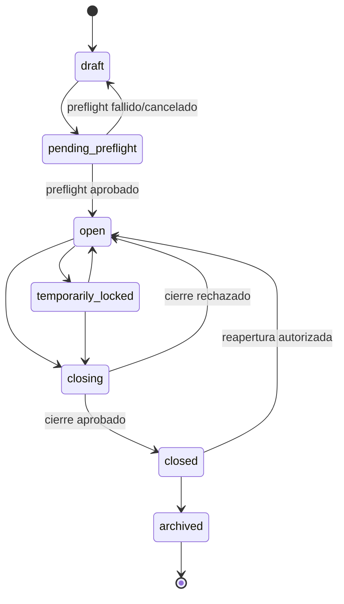
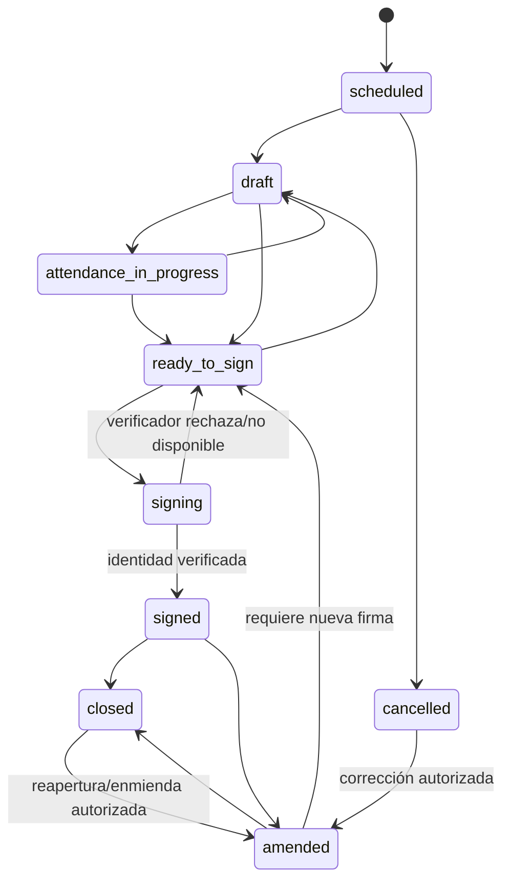
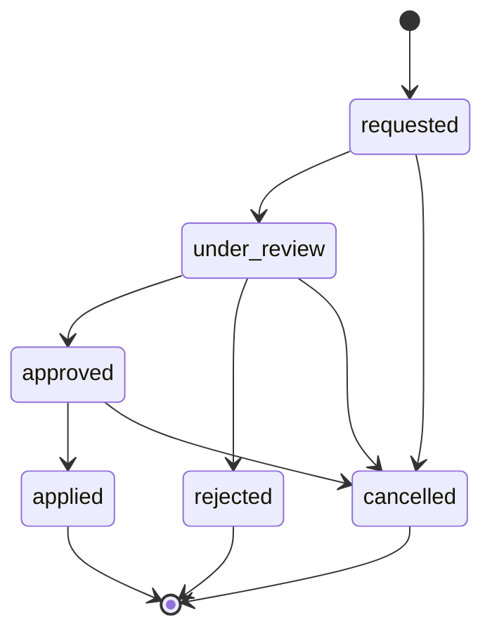
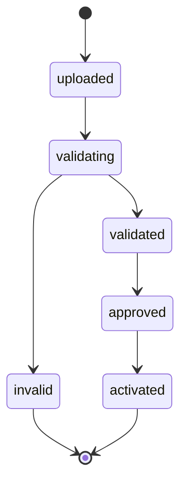
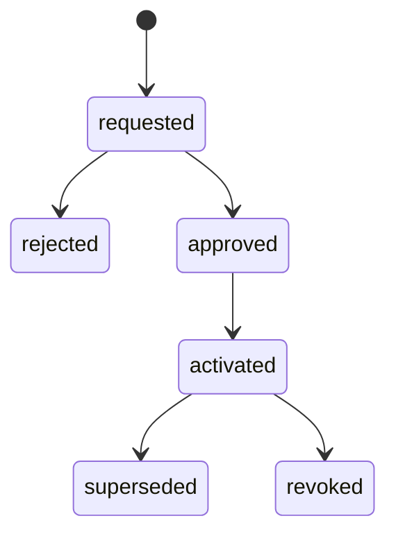
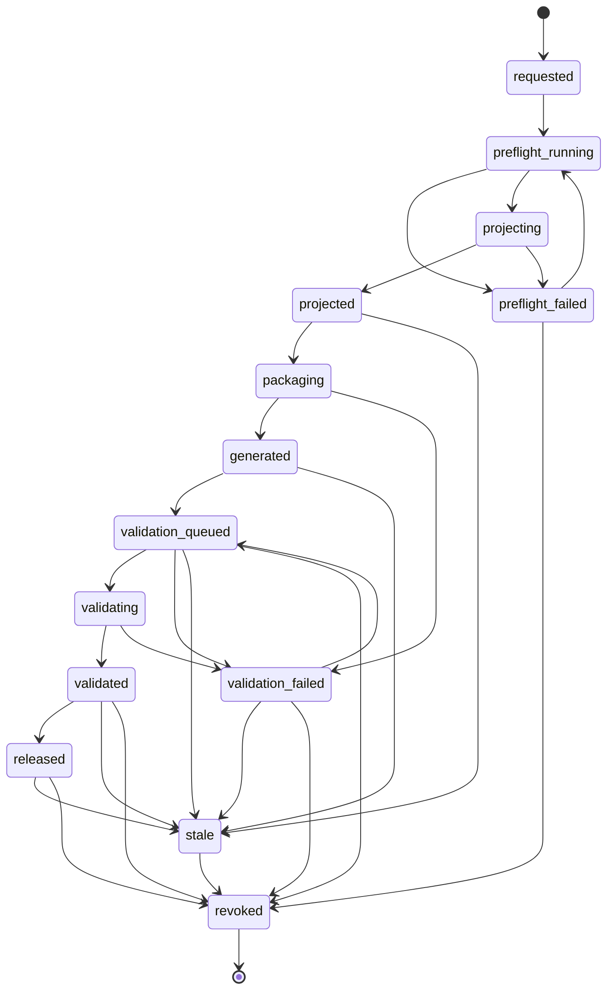

# Máquinas de estado

## Estado de implementación

`WorkflowStateMachine`, los enums `BookStatus`, `SessionStatus`, `AmendmentStatus` y `EdeExportStatus`, y los defaults iniciales de sus migraciones usan ya el mismo vocabulario detallado. La prueba unitaria cubre el grafo declarado.

Eso no prueba enforcement end-to-end. Varios servicios asignan estados directamente para ejecutar el workflow y la API de negocio sigue en construcción. Antes de activar el módulo, cada transición debe pasar por un caso de uso que valide `assertCan` o una guarda equivalente, permisos, scope, invariantes, lock/idempotencia y auditoría dentro de la unidad transaccional correspondiente.

## Libro

Máquina implementada en `WorkflowStateMachine`:

### Guardas

| Transición | Condiciones mínimas |
|---|---|
| `draft → pending_preflight` | perfil vigente, escuela/año/curso, fuente papel/digital definida y actor autorizado. |
| `pending_preflight → open` | preflight sin blockers; si hubo papel, transferencia previa conciliada; nómina inicial sellada. |
| `open → temporarily_locked` | motivo, actor y ventana; bloquea mutaciones, no lectura. |
| `open/temporarily_locked → closing` | periodos, asistencia, firmas, evaluaciones y enmiendas pendientes resueltos. |
| `closing → closed` | snapshot/hash de cierre, aprobación y auditoría. |
| `closed → open` | `lcd_closure_reopenings` aprobada; no se borra cierre original; genera revisión. |
| `closed → archived` | retención y backups vigentes; archivar no significa borrar. |

## Sesión

### Guardas de firma

- asignación docente vigente y firmante igual al docente efectivo autorizado;
- snapshot de nómina sellado;
- asistencia completa para todos los ítems aplicables;
- leccionario mínimo completo;
- hash canónico calculado sobre la revisión exacta;
- `If-Match` vigente e idempotencia de la solicitud;
- verificador oficial disponible y resultado satisfactorio;
- no existe otra firma de ese staff para la misma entidad+revisión;
- no existe enmienda, cierre o exportación concurrente incompatible.

Una falla del verificador vuelve a `ready_to_sign`, conserva el borrador y registra solo datos técnicos sanitizados. Nunca crea una firma local.

## Enmienda

### Aplicación de una enmienda

`AmendmentService` implementa solicitud, una aprobación, aplicación con revisión y marcado `stale` de exportaciones/paquetes. Aún no está expuesto por API ni impone por sí solo que solicitante, revisor y aplicador sean distintos; tampoco restringe la propuesta a una allowlist por agregado ni ejecuta la nueva firma. Por ello el flujo sigue parcial.

La transición `approved → applied` debe ser atómica:

1. bloquear la entidad y comparar su revisión con `original_revision`;
2. conservar la revisión anterior;
3. crear `lcd_record_revisions` con payload/hash nuevo;
4. enlazar `previous_revision_id` y solicitud;
5. decidir si requiere nueva firma/reapertura;
6. marcar exportaciones/paquetes afectados `stale` o revocados;
7. incrementar `revision`/`lock_version`;
8. registrar auditoría;
9. nunca sobrescribir o eliminar la evidencia original.

## Importación y activación curricular

El modelo de lote declara solo este vocabulario:

La decisión se registra en una entidad separada:

No existen estados de lote `validation_failed`, `approval_pending`, `rejected`, `activating` ni `failed`. El servicio HTTP persiste directamente `invalid` o `validated` y fuerza `validated → approved → activated` con transacción/lock; `uploaded` y `validating` no se observan como estados intermedios persistidos. Un lote `validated` puede acumular evidencias por `source_key`; la activación `approved → activated` falla si falta una fuente vinculada o su hash/archivo no supera integridad. La activación separada se crea directamente `activated` y solo se usa además `superseded`; no hay endpoints de `requested`, `approved`, `rejected` o `revoked`. El contrato y sus gaps de procedencia/SoD están en [CURRICULUM_IMPORT_RUNBOOK.md](CURRICULUM_IMPORT_RUNBOOK.md).

## Exportación EDE

### Regla de `validated`

Solo se permite cuando:

- la versión EDE y el mapping están importados con hashes;
- el snapshot fuente es íntegro y no cambió;
- los archivos/manifiesto coinciden con sus SHA-256;
- el contenedor está fijado por digest;
- `check` terminó con exit code satisfactorio;
- el reporte oficial está almacenado y hashado;
- no existen errores críticos.

La API y el comando no ejecutan Docker sincrónicamente: una solicitud autorizada pasa de `generated`/`validation_failed` a `validation_queued` y encola `ValidateLibroDigitalEdeExport`; solo el worker puede entrar en `validating`. Existe un `EdeValidatorRunner` que modela `parse`, `insert` y `check` en Docker endurecido, pero está bloqueado por configuración, digest y contrato de argv. Nunca se ha ejecutado contra el artefacto oficial. Por ello hoy ninguna exportación puede llegar legítimamente a `validated`; `validator_status` debe continuar `not_run`.

## Estados auxiliares

| Entidad | Estados definidos | Observación |
|---|---|---|
| Firma | `pending`, `verified`, `rejected`, `failed`, `expired` | `verified` exige resultado positivo del verifier configurado; `fake` solo puede usarse en tests y no es evidencia oficial. `failed/rejected` no dejan la sesión firmada. |
| Evaluación | `draft`, `published`, `results_open`, `closed`, `amended`, `cancelled` | Falta máquina y guardas de publicación/cierre. |
| Caso de ausencia | `open`, `monitoring`, `contacted`, `escalated`, `resolved`, `closed` | Estados de seguimiento, nunca baja automática de matrícula. |
| Cierre | `open`, `closed`, `reopened`, `reclosed` | Cada reapertura conserva el cierre/revisión original. |
| Reporte | `queued`, `processing`, `completed`, `failed`, `expired`, `cancelled` | `expired` revoca descarga; no elimina automáticamente archivo/evidencia. |
| Asistencia de sesión | `present`, `absent`, `late`, `left_early`, `not_applicable` en servicio | Justificación es atributo/entidad separada; el enum además declara `excused`, pero el servicio no lo acepta como marca primaria. |

## Alineación lograda y discrepancias restantes

| Dominio | Evidencia actual | Riesgo pendiente |
|---|---|---|
| Libro | Enum, workflow y default `draft` alineados; controlador consulta la máquina y ejecuta `closing → closed` dentro de la transacción. | Solo el cambio final queda en el evento resumido; falta cobertura feature completa de guardas, concurrencia y evidencia intermedia. |
| Sesión | Enum, workflow y default `scheduled` alineados; firma usa `ready_to_sign → signing → signed`; cancelación consulta la máquina. | Servicios/API deben demostrar que ningún update alternativo salta transición/auditoría. |
| Enmienda | Servicio/API usan solicitud, revisión, aprobación/aplicación; allowlist y tres actores se prueban en sesión, creando revisión y `stale`/reapertura de cierres. | Probar todos los tipos/campos, carreras, nueva firma real y que el uso de `under_review` sea uniforme en persistencia/API. |
| Currículo | Plantilla de cinco hojas, reader/validador multisource, adjuntos oficiales cifrados/hashados, relaciones N:M, servicio/API, lote/evidencia/activación y locks pasan la suite focalizada. | Sin corpus oficial NT1–4M importado/reconciliado/UAT; `000009`–`000011` siguen pendientes en la base local; faltan rechazo/revocación y SoD aprobador–activador. El estado `activated` con fixtures no cierra cumplimiento. |
| EDE | Enum y `WorkflowStateMachine` incluyen `validation_queued`; export job avanza hasta `generated/not_run` y la solicitud encola un job único antes del runner. | Probar que controlador/job/runner aplican el mismo grafo y lock en carreras/reintentos. La versión oficial y corrida real no existen. |
| Asistencia | Servicio acepta cinco estados y exige horas para `late`/`left_early`. | `AttendanceStatus::Excused` no coincide con el contrato primario; debe quedar fuera o definirse formalmente. |
| Contrato de asistencia | El controlador adapta `arrival_time/departure_time` a timestamps UTC y aplica `OptimisticLock` antes del servicio. | Sin pruebas feature/DST; `justification` y `observation` se compactan en `notes`, sin crear todavía el expediente formal de justificación. |
| UI | Reconoce aliases/presentaciones locales. | Normalizar en Resources/adaptador; nunca persistir aliases como estados canónicos. |

## Plan de cierre forward-only

1. Mantener como vocabulario canónico los enums/workflow actuales y documentar toda futura incorporación.
2. Implementar una única puerta de transición por agregado; prohibir `status=` en controladores o mass assignment genérico.
3. Probar los adapters DTO/Form Request/servicios y separar la semántica de justificación/observación antes de exponer rutas.
4. Si ya existieran filas con un valor legado, normalizarlas solo mediante migración **aditiva**, con evidencia inequívoca, backup y conteos; nunca recrear/borrar tablas.
5. Definir mapping de presentación UI separado del valor persistido.
6. Agregar constraints de BD compatibles con el motor únicamente después de sanear/probar datos existentes.
7. Probar transición permitida/prohibida, permisos, carrera, idempotencia, auditoría y side effects (`stale`, revisión, firma).
8. Versionar el contrato de las 94 rutas API v1 existentes y sus eventos antes de incorporar consumidores estables; toda ampliación debe conservar compatibilidad o publicar una nueva versión.

## Auditoría por transición

Cada transición crítica registra:

- `from`, `to`, entidad, ID público y revisión;
- actor, rol, escuela/año, asignación y, si aplica, aprobador;
- motivo/evidencia para cancelación, reapertura, rechazo o revocación;
- `before_hash`, `after_hash`, `correlation_id` e idempotency key;
- resultado y failure code sanitizado;
- exportaciones/paquetes marcados stale/revocados.

La escritura de estado y evento debe ocurrir en la misma transacción o mediante outbox/`afterCommit` idempotente con reconciliación; nunca se considera completada si queda sin trazabilidad.
