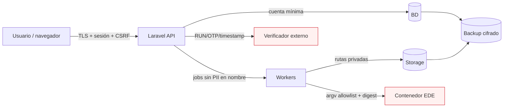

# Modelo de amenazas STRIDE

## Alcance

Incluye navegador Vue, API Laravel, autenticación/RBAC, base ERP/LCD, workers, almacenamiento privado, backups, verificador de identidad, contenedor EDE y futuros mecanismos SIGE. Activos principales:

- identidad y asignación de docentes/profesionales;
- registros firmados, nóminas, asistencia, notas y cierres;
- datos sensibles PIE, convivencia y parvularia;
- OTP y respuestas del verificador;
- auditoría/hash chain;
- fuentes/mapeos/versiones EDE, exports y paquetes;
- archivos, reportes, claves y backups.

## Límites de confianza

## Escala de riesgo

- **Crítico:** firma falsa, alteración/pérdida de registro oficial, fuga masiva/NNA, clave o backup comprometido.
- **Alto:** acceso entre escuelas, PIE/convivencia expuesto, export EDE manipulado, auditoría evadida.
- **Medio:** indisponibilidad acotada, reporte incorrecto con detección previa, metadata excesiva.
- **Bajo:** error sin datos/impacto oficial y con recuperación inmediata.

## Matriz STRIDE

| Categoría | Amenaza/escenario | Impacto | Controles existentes | Tratamiento pendiente |
|---|---|---:|---|---|
| Spoofing | Atacante usa sesión robada para operar como docente. | Crítico | autenticación ERP; asignación/RUN en `TeacherSignatureService`. | MFA/reautenticación, session hardening, detección anómala y tests end-to-end. |
| Spoofing | Usuario firma por otro docente o por impersonación. | Crítico | comparación staff/docentes/asignación; firma propia; no fallback. | policy/API, bloquear impersonación, credenciales reales y test adversarial. |
| Spoofing | Phishing cambia destinatario de fiscalización. | Alto | runbook con canal verificado. | workflow cuatro ojos y binding del receptor a URL. |
| Tampering | Editar sesión/asistencia después de firma. | Crítico | estados, lock, payload hash, revisiones/enmiendas y FK restrict. | API completa, constraints, pruebas de DB/direct write y permisos de cuenta. |
| Tampering | Alterar evento de auditoría o cortar cadena. | Crítico | hash previo/evento y verificador; modelo rechaza update/delete. | permisos DB append-only, command/scheduler, anclaje externo opcional. |
| Tampering | Modificar mapping/output EDE para pasar validador. | Alto | hashes y tablas versionadas; proyector declarativo. | importación oficial, approvals, runner/digest, validación oficial y storage inmutable. |
| Tampering | Formula injection al abrir CSV/XLSX. | Medio | builders anteponen apóstrofo; tests unitarios básicos. | tests en todos los campos/lectores, descarga y política de importación. |
| Repudiation | Actor niega firma/corrección/descarga. | Alto | usuario/staff, correlación, intentos, hashes, IP cifrada y user-agent hash. | clock/NTP, cobertura total de auditoría, política de evidencia y verificador real. |
| Repudiation | Soporte modifica bajo otra identidad. | Crítico | campos impersonator/break-glass en schema/writer. | middleware de break-glass, ticket/approval/TTL y prohibiciones efectivas. |
| Information disclosure | IDOR permite escuela A→B. | Crítico | `LibroDigitalAccessContext` valida membresía escolar. | aplicar en todos los endpoints, policies/asignaciones y suite multi-tenant. |
| Information disclosure | Reporte amplía scope o mezcla escuelas. | Crítico | request fija escuela, snapshot cifrado/hashado; descarga autenticada/expirable y storage privado. | matriz completa de scope/permisos, filtros seguros, prueba IDOR de descarga y revisión visual. |
| Information disclosure | PIE/convivencia aparece en logs/cache/UI general. | Alto | campos cifrados previstos; reglas documentadas. | casts reales, serializers, RBAC fino, no-cache y tests de redacción. |
| Information disclosure | OTP/RUN aparece en URL/excepción/APM. | Crítico | no persistencia, excepción sanitizada, sin retry, rate limit, correlación anti-replay y circuit breaker. | redacción HTTP/APM/logs comprobada y ventana temporal institucional. |
| Information disclosure | Backup/storage público o link filtrado. | Crítico | rutas privadas/config, cifrado de algunos outputs. | ACL/KMS, URLs cortas, egress scan, canary y restore auditado. |
| Denial of service | Reportes/EDE masivos agotan CPU/memoria/storage. | Alto | jobs/timeout; EDE job tries=1, reporte timeout. | quotas, queue separation, limits Docker, streaming, admission control y alertas. |
| Denial of service | OTP flood bloquea docentes/verificador. | Alto | timeout/sin retry, rate limit y circuit breaker. | límites aprobados por contrato, métricas no PII, alertas y prueba de recuperación. |
| Denial of service | Locks de BD por snapshot/export. | Alto | proyector corre en job. | snapshot corto consistente, chunking, índices y load tests. |
| Elevation of privilege | Capability UI manipulada o permiso global evita scope. | Crítico | router/permisos y access context emergentes. | backend siempre autoritativo, policies por objeto, no confiar payload/capability. |
| Elevation of privilege | Seeder asigna todos los usuarios a una escuela. | Alto | flags apagados. | revisar/eliminar presunción `single_school_migration`; memberships explícitas y pruebas. |
| Elevation of privilege | Soporte/superadmin firma o libera paquete. | Crítico | regla documentada; soporte limitado en seeder. | permiso no delegable y segregación de liberación en policies/workflow. |
| Elevation of privilege | Command injection en contenedor EDE. | Crítico | `EdeValidatorRunner` usa operación/argv allowlist, `Process` sin shell, digest y capacidades reducidas. | fijar/probar argv y digest oficiales, usuario efectivo/seccomp/mounts, host destino y fuzz de configuración. |
| Supply chain | Imagen `edemineduc/etl` mutable/comprometida. | Crítico | flags y export assertReady exigen digest/contrato. | obtener digest oficial, scan/SBOM/approval, mirror confiable y pin por ambiente. |
| Supply chain | XLSX/diccionario contiene fórmula/macro/enlace hostil. | Alto | importador aún no existe. | parser sin ejecución, MIME/size, sandbox, hash y revisión de diff. |
| Integrity | Proyector lee revisiones mezcladas mientras cambian datos. | Alto | manifest/hash y job. | snapshot transaccional consistente; el `sourceDataset` actual hace múltiples queries sin snapshot fijo. |

## Abuso de negocio

### Firma con doble clic o replay

Ruta de ataque: dos solicitudes pasan preparación, consumen OTP o crean dos firmas. Controles: unique entidad+revisión+staff, lock, `signing`, lock version, correlación anti-replay y rate limit; middleware de idempotencia existe. Pendiente: ruta/API expuesta y probada, atomicidad del store de idempotencia y prueba concurrente real.

### Baja automática por ausencia

Ruta de ataque: regla/alerta marca retiro y borra historia. Control requerido: casos solo de seguimiento, resolución humana bajo Reglamento Interno, aprobación, evidencia, sin delete/rewrite. La implementación no debe ofrecer transición automática a baja.

### Inflar asistencia o subvención

Ruta de ataque: transformar atraso/ausencia en presente por regla no verificada. Control: separar asistencia de sesión, diaria, subvención y SIGE; mantener subsidy resolver bloqueado hasta fuente oficial íntegra.

### “Validación” falsa

Ruta de ataque: marcar staging JSON o test local como EDE válido. Control: `validator_status=not_run`, digest obligatorio, reporte/exit code/hash y texto no certificado. Ningún rol puede editar el status libremente.

### Exfiltración por reportes

Ruta de ataque: usuario con `reports.export` genera informe de toda la escuela. Control: scope hereda exactamente permisos del dato, minimización, límites, four-eyes para masivos, watermark, descarga auditada y detección de volumen.

## Controles prioritarios antes del piloto

1. API/policies y tests de aislamiento/asignación.
2. Mantener enums/workflow alineados y demostrar enforcement/contratos de asistencia en cada endpoint.
3. Cifrado real/serialización segura de todos los campos sensibles.
4. Redacción automática de HTTP/log/APM y pruebas de secretos.
5. Probar rate limit/replay/circuit breaker de firma y cerrar contrato/credenciales/redacción.
6. DPIA, notices, derechos, brechas y proveedores.
7. Backup/restauración y permisos DB append-only.
8. Scope consistente de reportes y snapshots transaccionales EDE.
9. Review del seeder de membresía escolar y segregación de fiscalización.
10. Fijar/probar runner EDE, formato, argv y digest; mientras tanto mantener EDE apagado.

## Verificación continua

- SAST/SCA/secret scan en cada cambio;
- pruebas feature de RBAC/IDOR y fuzz de IDs/inputs;
- DAST autenticado en staging;
- revisión mensual de permisos y break-glass;
- verificación diaria/regular de auditoría;
- alertas de descargas, firma fallida, exportaciones y acceso anómalo;
- tabletop de incidente y restore;
- revisión del threat model ante nueva integración, dato, proveedor o cambio normativo.

## Riesgo residual

Con firma, EDE, SIGE y fiscalización apagados, queda riesgo por el esquema/UI/reportes emergentes, configuración/RBAC y eventual uso de datos reales. No habilitar siquiera el núcleo hasta cerrar API/autorización, privacidad, cifrado, restore y pruebas. El riesgo residual debe aceptarse por responsables institucionales, no solo por desarrollo.
