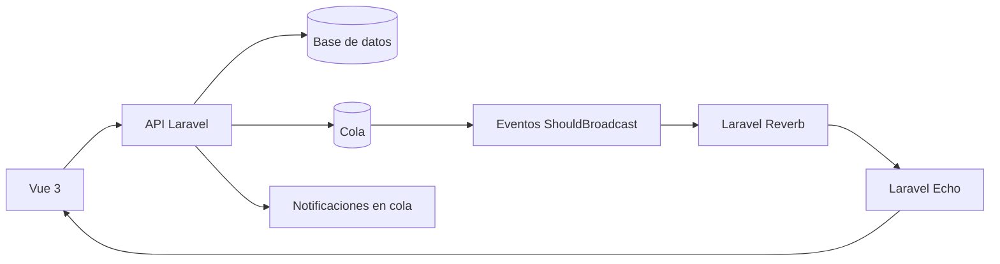

# Módulo de mensajería interna en tiempo real

## Arquitectura

`/mensajeria` es la bandeja institucional para usuarios autenticados y activos. Soporta conversaciones directas y grupales, comunicaciones formales, audiencia inmutable por mensaje, adjuntos privados, entrega, lectura y acuse explícito.



No existe polling periódico. La base de datos sigue siendo la fuente oficial y el WebSocket comunica cambios pequeños. El frontend se recupera de una desconexión mediante una única consulta incremental al volver a conectar.

Componentes principales:

- Backend: controladores API, Form Requests, políticas y servicios transaccionales bajo `app/Services/Messaging`.
- Eventos: `app/Events/Messaging`, en la cola `broadcasts` y enviados después de confirmar la transacción.
- WebSocket: Reverb con canales privados autenticados por Sanctum.
- Frontend: `resources/js/modules/messaging`, cargado de manera diferida únicamente en sesiones autenticadas.
- Notificaciones: cola `notifications`, separada lógicamente de los eventos de tiempo real.

## Canales y eventos

| Canal privado | Audiencia | Eventos |
| --- | --- | --- |
| `messaging.user.{userId}` | Solo el mismo usuario activo | `messaging.conversation.changed` |
| `messaging.conversation.{publicId}` | Participantes activos de la conversación | created, updated, deleted, reaction, read y acknowledged |

La autorización está en `routes/channels.php`. Un participante con `left_at` ya no puede abrir la conversación, consultar sus mensajes, buscar contenido, descargar adjuntos ni suscribirse al canal. Las respuestas no autorizadas se presentan como 404 para no revelar la existencia del recurso.

El navegador mantiene una sola conexión Echo, una suscripción al canal del usuario y una suscripción a la conversación actualmente visible. Al cambiar de conversación abandona el canal anterior. Axios agrega `X-Socket-ID` para que `toOthers()` no duplique en el emisor el cambio que ya aplicó de forma optimista.

## Historial, reconexión y consistencia

El historial usa cursores estables, no números de página:

- `before={messagePublicId}` carga mensajes anteriores al subir en la cronología.
- `after_id={messagePublicId}` recupera mensajes posteriores tras reconectar.
- `has_more` informa si queda historial anterior.
- `sync_cursor` permite mantener un punto de sincronización de servidor.

La interfaz conserva la posición visual al anteponer mensajes antiguos. Después de una caída de red muestra estado de reconexión y, al volver, ejecuta una sola recuperación incremental más un refresco de resumen/conversaciones. No inicia un temporizador de cinco segundos ni otra consulta permanente.

Los estados entregado y leído se actualizan en bloque. Los eventos incluyen solo los campos necesarios; los cuerpos completos no se escriben en logs de infraestructura.

## Modelo de datos

- `conversations`: cabecera, ULID público, tipo, contexto opcional y último mensaje.
- `conversation_participants`: propietario/administrador/integrante, baja y preferencias.
- `messages`: texto, comunicación formal, respuesta, prioridad, versión, SHA-256 y soft delete.
- `message_recipients`: audiencia inmutable y estados individuales de entrega, lectura y acuse.
- `message_versions`: historial de mensajes editables.
- `message_attachments`: metadatos privados, checksum y ULID de descarga.
- `message_mentions` y `message_reactions`: menciones y reacciones.
- `messaging_audit_events`: bitácora append-only.
- `messaging_temporary_uploads`: cargas previas al envío, propiedad, caducidad y consumo único.

La migración de rendimiento agrega únicamente un índice compuesto a `conversation_participants`; no elimina ni transforma registros.

## Seguridad y permisos

Todo usuario autenticado y activo puede usar el acceso básico. Los privilegios administrativos siguen en el RBAC existente:

- `messaging.send_announcement`
- `messaging.view_receipts`
- `messaging.send_reminder`
- `messaging.waive_acknowledgement`
- `messaging.moderate`

Controles relevantes:

- Canales privados y endpoint `/broadcasting/auth` protegido por `api` y `auth:sanctum`.
- Validación de origen WebSocket mediante `REVERB_ALLOWED_ORIGINS`; no usar `*` en producción.
- Autorización por participación activa tanto en HTTP como en WebSocket.
- Adjuntos en disco privado con validación de MIME, extensión y tamaño.
- Mensajes expuestos mediante ULID; las claves internas no forman parte de la API pública.
- Eventos después del commit para evitar estados fantasma si una transacción falla.

No configure `MESSAGING_FILESYSTEM_DISK=public`.

## Configuración local

Variables mínimas (use credenciales distintas por entorno):

```dotenv
BROADCAST_DRIVER=reverb
QUEUE_CONNECTION=database
MESSAGING_ENABLED=true
MESSAGING_REALTIME_ENABLED=true
MESSAGING_RECOVERY_LIMIT=100

REVERB_APP_ID=local-id
REVERB_APP_KEY=local-key
REVERB_APP_SECRET=local-secret
REVERB_HOST=localhost
REVERB_PORT=8080
REVERB_SCHEME=http
REVERB_ALLOWED_ORIGINS=127.0.0.1,localhost

VITE_REVERB_APP_KEY="${REVERB_APP_KEY}"
VITE_REVERB_HOST="${REVERB_HOST}"
VITE_REVERB_PORT="${REVERB_PORT}"
VITE_REVERB_SCHEME="${REVERB_SCHEME}"
```

Procesos locales:

```bash
php artisan serve
php artisan reverb:start --host=127.0.0.1 --port=8080
php artisan queue:work database --queue=broadcasts,notifications,default --sleep=1 --tries=3 --timeout=90
```

Si cambia variables de entorno, ejecute `php artisan config:clear` y reinicie Reverb y los workers.

## Preparación para producción (no ejecutada)

La activación en producción debe realizarse en una ventana controlada. Antes de migrar:

1. Tomar un respaldo completo y verificable de la base de datos y de los adjuntos privados.
2. Revisar `php artisan migrate:status` y el SQL de cada migración pendiente.
3. No ejecutar seeders generales ni comandos que trunquen, recreen o sincronicen tablas destructivamente.
4. Mantener el respaldo fuera del servidor de aplicación y comprobar que puede restaurarse.
5. Ejecutar las migraciones aditivas solo después de la validación anterior.

Configuración sugerida:

> Aplicar este bloque solo después de aprovisionar `ws.cnscvaldivia.cl` con
> DNS, proxy WebSocket y certificado TLS válidos. El VPS actual mantiene
> broadcasting en `log` y no publica un servicio Reverb.

```dotenv
BROADCAST_DRIVER=reverb
QUEUE_CONNECTION=redis
MESSAGING_REALTIME_ENABLED=true
REVERB_HOST=ws.cnscvaldivia.cl
REVERB_PORT=443
REVERB_SCHEME=https
REVERB_ALLOWED_ORIGINS=www.cnscvaldivia.cl,cnscvaldivia.cl
```

Reverb y los workers deben quedar bajo Supervisor o systemd, con reinicio automático, usuario sin privilegios y logs rotados. Separar las colas permite priorizar los broadcasts:

```ini
command=php /ruta/app/artisan queue:work redis --queue=broadcasts,notifications,default --sleep=1 --tries=3 --timeout=90
command=php /ruta/app/artisan reverb:start --host=127.0.0.1 --port=8080
autostart=true
autorestart=true
stopasgroup=true
killasgroup=true
```

El proxy HTTPS debe preservar `Upgrade` y `Connection` hacia Reverb. Después de desplegar:

```bash
php artisan optimize:clear
php artisan migrate --force
npm ci
npm run prod
php artisan config:cache
php artisan route:cache
php artisan queue:restart
```

No ejecute esta secuencia sin el respaldo previo y sin adaptar host, usuario, rutas y gestor de procesos. Las credenciales Reverb nunca deben reutilizarse entre local y producción.

## Monitoreo y recuperación

Monitorear al menos:

- disponibilidad del puerto/proxy WebSocket y cantidad de conexiones;
- profundidad, latencia y fallos de las colas `broadcasts` y `notifications`;
- errores de autorización de canales y reconexiones anómalas;
- CPU, memoria y reinicios de Reverb/workers;
- respuestas 5xx de `/api/messaging` y `/broadcasting/auth`.

Ante una falla de Reverb, los mensajes siguen persistiendo por HTTP y se recuperan al reconectar. El frontend no vuelve a polling. Para una interrupción prolongada, repare/reinicie el servicio y los workers; no borre colas ni mensajes. Como rollback de código, restaure la versión anterior y mantenga las tablas/índices hasta comprobar compatibilidad; no elimine datos como parte del rollback urgente.

## Pruebas

```bash
php artisan test tests/Feature/Messaging/MessagingModuleTest.php
npm run test:unit
npm run prod
php artisan route:list --path=broadcasting/auth
php artisan route:list --path=api/messaging
```

La cobertura incluye autenticación, aislamiento de participantes retirados, cursores sin solapamiento, conversación directa única, audiencia, lectura/acuse, idempotencia, hash y emisión de eventos pequeños. La validación manual recomendada usa dos pestañas autenticadas para comprobar recepción instantánea, reconexión y carga del historial al subir.

## Respaldo funcional

Incluya todas las tablas `messaging_*`, `conversations`, `conversation_participants`, `messages`, `message_*` y el directorio privado `storage/app/.../messaging` en el mismo punto consistente de respaldo. Para restaurar, recupere primero la base y después los archivos, preservando rutas y permisos.
