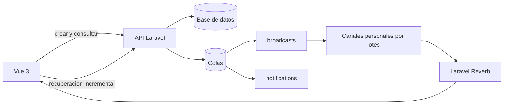

# Modulo de mensajeria interna

## Arquitectura hibrida

`/mensajeria` es la bandeja institucional exclusiva para funcionarios autenticados y activos. Soporta conversaciones directas y grupales, comunicaciones formales, adjuntos privados, entrega, lectura y acuse explicito.

La identidad se resuelve en el backend mediante la regla institucional central: `user_type=staff` o una vinculacion laboral vigente por `staff_id`, siempre que la cuenta no sea estudiante, apoderado ni una previsualizacion de rol. Un permiso, un rol administrativo o una opcion de menu no reemplazan esta comprobacion.

La base de datos es siempre la fuente oficial. El transporte en tiempo real es una optimizacion y nunca sustituye la persistencia HTTP:



- HTTP persiste mensajes, entrega cursores e implementa la recuperacion incremental.
- Reverb comunica cambios pequenos por el canal privado personal de cada destinatario cuando esta habilitado y saludable.
- El fallback HTTP consulta solo cambios posteriores al ultimo cursor. Debe pausarse con la pestana oculta o sin red y aplicar backoff con jitter; no debe refrescar historiales completos.
- Si Reverb falla, enviar mensajes sigue dependiendo de HTTP. Al recuperarse la conexion se ejecuta una sola sincronizacion incremental.
- `broadcasts` y `notifications` son colas interactivas y deben estar separadas de exportaciones, analisis u otros trabajos largos.

No se debe declarar el chat "en tiempo real" por tener un bundle compilado o por configurar variables. La aceptacion exige proceso Reverb activo, proxy WSS operativo, autorizacion de canal, worker `broadcasts` consumiendo y un evento recibido entre dos sesiones reales.

## Canales, cursores y consistencia

| Canal privado | Audiencia | Uso |
| --- | --- | --- |
| `messaging.user.{userId}` | Solo el mismo funcionario activo | Cambios de conversaciones, mensajes, ediciones, eliminaciones, reacciones, lectura, acuses y contadores |

El transporte de mensajeria consume un solo canal personal por usuario; no mantiene suscripciones por conversacion. Antes de emitir, el backend vuelve a obtener los participantes activos y divide la audiencia en lotes acotados de 100 canales personales. Por eso un usuario retirado (`left_at`) o inactivo deja de recibir eventos posteriores, aunque conserve abierta su sesion WebSocket. Cada payload incluye `conversation_id` para que el cliente aplique el cambio correspondiente o ejecute recuperacion incremental.

La autorizacion se define en `routes/channels.php` y `/broadcasting/auth` usa Sanctum. El canal `messaging.user.{userId}` solo autoriza al mismo usuario cuando su cuenta esta activa; la consulta HTTP de cada conversacion sigue comprobando membresia vigente.

El historial utiliza cursores estables:

- `before={messagePublicId}` carga mensajes anteriores;
- `after_id={messagePublicId}` recupera mensajes nuevos tras una desconexion;
- `updated_since={timestamp}` recupera ediciones, reacciones o acuses;
- `has_more` indica si existe mas historial;
- `sync_cursor` fija el punto confirmado por el servidor.

El cliente debe mantener un unico refresh en vuelo, ignorar eventos duplicados y enviar un acuse de lectura solo cuando avance el ultimo mensaje leido. Una respuesta sin cambios no debe insertar auditoria, emitir broadcasts ni actualizar filas.

La difusion no transporta el historial completo. Los eventos de creacion y edicion llevan referencias y una vista breve de bandeja; el cliente obtiene por HTTP cualquier detalle que falte. Esto mantiene cada solicitud a Reverb bajo el limite configurado aun en conversaciones numerosas.

## Modelo y privacidad

- `conversations`: cabecera y ultimo mensaje.
- `conversation_participants`: membresia, rol, preferencias y cursor de lectura.
- `messages`: contenido, prioridad, version, hash y soft delete.
- `message_recipients`: audiencia inmutable y estados individuales.
- `message_versions`: historial de edicion.
- `message_attachments`: metadatos de adjuntos privados.
- `message_mentions` y `message_reactions`: interacciones.
- `messaging_audit_events`: bitacora append-only de cambios reales.
- `messaging_temporary_uploads`: cargas privadas con expiracion y consumo unico.

No configure `MESSAGING_FILESYSTEM_DISK=public`. Los cuerpos, adjuntos, tokens, cookies y secretos Reverb no deben aparecer en logs de infraestructura ni endpoints de health.

## Seguridad y permisos

El acceso basico exige un funcionario autenticado y activo. Esta condicion se aplica en middleware, politicas, autorizacion WebSocket, buscadores de destinatarios, fan-out y trabajos asincronos. Incluso un superadministrador debe poseer identidad de funcionario para usar el chat. Las acciones administrativas conservan los permisos RBAC existentes:

- `messaging.send_announcement`;
- `messaging.view_receipts`;
- `messaging.send_reminder`;
- `messaging.waive_acknowledgement`;
- `messaging.moderate`.

Los canales son privados y `/broadcasting/auth` esta protegido por Sanctum. La suscripcion personal comprueba identidad de funcionario y cuenta activa; cada lectura o descarga HTTP vuelve a comprobar la participacion vigente en la conversacion. Los adjuntos se validan por MIME, extension y tamano; la API publica usa ULID y no expone claves internas. Mantenga tambien los limites HTTP especificos de busqueda, envio, anuncios, acuses y cargas.

Los registros historicos de conversaciones o recibos asociados a cuentas que ya no son elegibles no se eliminan ni se reescriben. Esas cuentas no pueden invocar la API ni recibir canales, nuevas audiencias, notificaciones o recordatorios. Los informes de recibos y acuses que consulta un funcionario autorizado conservan sus snapshots historicos completos, incluso si un destinatario dejo posteriormente de ser funcionario. Esto mantiene la trazabilidad sin seguir habilitando el chat a esa cuenta.

Enviar recordatorios es una capacidad distinta de consultar recibos. `messaging.view_receipts` por si solo no permite enviarlos: la accion requiere ser remitente del mensaje, propietario/administrador vigente de la conversacion, superadmin o tener `messaging.send_reminder` de forma explicita.

## Recordatorios de acuse

Los recordatorios no crean notificaciones ni auditorias dentro de la solicitud HTTP. El endpoint manual selecciona recibos elegibles y encola trabajos de hasta 200 recibos en `notifications`; el comando automatico hace lo mismo cada 30 minutos.

Cada trabajo vuelve a comprobar, justo antes de escribir:

- `MESSAGING_ENABLED=true`;
- cuenta destinataria activa;
- membresia vigente en la conversacion (`left_at` nulo);
- mensaje y conversacion no eliminados;
- acuse requerido, pendiente y no eximido;
- fecha y periodo de enfriamiento aplicables.

La reclamacion se realiza dentro de una transaccion con bloqueo de los recibos. Las notificaciones, contadores y auditorias se insertan por lote en la misma transaccion, de modo que dos ejecuciones simultaneas del scheduler o del endpoint no generan el mismo recordatorio dos veces. Los trabajos ya encolados tambien terminan sin cambios si se apaga el modulo.

El cleanup de cargas temporales es independiente: continua ejecutandose aunque `MESSAGING_ENABLED=false` para no acumular archivos expirados.

## Flags y configuracion segura

`.env.example` deja el modulo cerrado por defecto. La activacion se realiza en fases:

| Variable | Funcion |
| --- | --- |
| `MESSAGING_ENABLED` | Habilita la experiencia de mensajeria |
| `MESSAGING_REALTIME_ENABLED` | Permite suscripciones y eventos Reverb |
| `MESSAGING_REALTIME_GRACE_MS` | Espera inicial antes de declarar degradado el canal realtime |
| `MESSAGING_HTTP_FALLBACK_ENABLED` | Conserva recuperacion cuando realtime no esta disponible |
| `MESSAGING_POLL_INTERVAL_MS` | Intervalo base del fallback inactivo |
| `MESSAGING_ACTIVE_POLL_INTERVAL_MS` | Intervalo minimo mientras se observa una conversacion |
| `MESSAGING_MAX_POLL_INTERVAL_MS` | Techo del backoff |
| `MESSAGING_RECONCILIATION_INTERVAL_MS` | Verificacion espaciada aun con realtime sano |
| `MESSAGING_POLL_JITTER_RATIO` | Desfase proporcional para evitar rafagas simultaneas |
| `BROADCAST_DRIVER` | `null` mientras Reverb no este listo; `reverb` al activarlo |
| `QUEUE_CONNECTION` | Conexion asincrona; nunca `sync` en produccion |

Configuracion HTTP local, sin WebSocket:

```dotenv
QUEUE_CONNECTION=database
BROADCAST_DRIVER=null
MESSAGING_ENABLED=true
MESSAGING_REALTIME_ENABLED=false
MESSAGING_HTTP_FALLBACK_ENABLED=true
```

Para probar Reverb localmente, genere credenciales exclusivas y agregue:

```dotenv
BROADCAST_DRIVER=reverb
MESSAGING_REALTIME_ENABLED=true
REVERB_APP_ID=local-id
REVERB_APP_KEY=local-key
REVERB_APP_SECRET=local-secret
REVERB_SERVER_HOST=127.0.0.1
REVERB_SERVER_PORT=8080
REVERB_HOST=127.0.0.1
REVERB_PORT=8080
REVERB_SCHEME=http
REVERB_ALLOWED_ORIGINS=127.0.0.1,localhost
VITE_REVERB_APP_KEY="${REVERB_APP_KEY}"
VITE_REVERB_HOST="${REVERB_HOST}"
VITE_REVERB_PORT="${REVERB_PORT}"
VITE_REVERB_SCHEME="${REVERB_SCHEME}"
```

Las variables `VITE_*` son publicas y quedan incorporadas al bundle. Nunca use ese prefijo para `REVERB_APP_SECRET`. Si el build se genera fuera del servidor, debe recibir los valores publicos del entorno objetivo; no se debe publicar un bundle que apunte a `localhost`.

`REVERB_ALLOWED_ORIGINS` recibe hosts sin esquema, ruta ni comodines. Despues de cambiar configuracion, limpie/reconstruya cache y reinicie los procesos persistentes para que tomen los nuevos valores.

El chat no utiliza eventos originados directamente por clientes. Mantenga `REVERB_APP_ACCEPT_CLIENT_EVENTS_FROM=none`; los cambios validos salen del backend despues de autorizar y persistir la operacion.

## Procesos locales

`scripts/serve-local.sh` inicia workers separados para:

- `broadcasts,notifications`, con timeout corto;
- `default`, sin mezclarlo con las colas interactivas;
- `class-presentations,pedagogical-instruments`, que conservan su timeout largo.

El script no inicia Reverb automaticamente. Cuando se pruebe realtime, ejecutelo en otra terminal:

```bash
php artisan reverb:start --host=127.0.0.1 --port=8080
```

Separar los procesos impide que un analisis de varios minutos bloquee un mensaje. En una cola database, `retry_after` debe ser mayor que el timeout maximo del worker correspondiente.

## Preparacion de produccion

### 1. Respaldo y revision

Antes de cualquier despliegue:

1. Crear un respaldo completo y verificable de la base de datos.
2. Respaldar en el mismo punto consistente el directorio privado `storage/app/.../messaging`.
3. Verificar integridad, tamano y SHA-256 de ambos respaldos y conservar una copia fuera del servidor de aplicacion.
4. Revisar `php artisan migrate:status` y el SQL de cada migracion pendiente.
5. Probar cualquier indice aditivo con `EXPLAIN`/`EXPLAIN ANALYZE` en staging o una copia representativa.
6. No ejecutar seeders generales, `migrate:fresh`, `migrate:refresh`, `migrate:reset`, `db:wipe` ni rollback destructivo.

El respaldo de base generado por `scripts/deploy.sh` no reemplaza el respaldo de adjuntos privados.

### 2. Infraestructura antes del flag

Provisionar antes de usar `BROADCAST_DRIVER=reverb`:

- DNS del host WSS;
- certificado TLS valido;
- proxy con headers `Upgrade` y `Connection`;
- Reverb escuchando solo en la interfaz interna;
- limites de conexiones, mensajes, memoria y archivos abiertos;
- workers exclusivos para `broadcasts` y `notifications`;
- logs rotados y sin contenido de mensajes;
- un unico scheduler por tarea o locks compartidos entre nodos.

Reverb y cada worker deben estar administrados por systemd o Supervisor con usuario sin privilegios, `autostart` y `autorestart`. Ejemplo conceptual para una conexion database:

```ini
command=php /ruta/app/artisan queue:work database --queue=broadcasts --sleep=1 --tries=3 --timeout=60 --max-time=3600
command=php /ruta/app/artisan queue:work database --queue=notifications --sleep=1 --tries=3 --timeout=60 --max-time=3600
command=php /ruta/app/artisan reverb:start --host=127.0.0.1 --port=8080
autostart=true
autorestart=true
stopasgroup=true
killasgroup=true
```

Los procesos largos deben conservar workers y conexiones separados. No agregue `broadcasts` al final de un unico worker que pueda quedar ocupado durante varios minutos.

El worker `notifications` es obligatorio tanto para avisos de mensajes nuevos como para recordatorios de acuse. Antes de activar el modulo, confirme que consume `SendAcknowledgementReminderBatch`, que su `timeout` no supera `retry_after` y que no usa `QUEUE_CONNECTION=sync`.

### 3. Activacion gradual

1. Desplegar codigo y assets con `MESSAGING_ENABLED=false`, `MESSAGING_REALTIME_ENABLED=false` y `BROADCAST_DRIVER=null`.
2. Confirmar workers, scheduler, DNS, TLS, proxy y Reverb sin exponer el modulo.
   Verificar especificamente que el scheduler no encola recordatorios mientras el flag esta apagado y que el cleanup temporal si continua registrado.
3. Habilitar primero mensajeria HTTP con fallback y observar consultas, errores y tiempos de respuesta.
4. Activar `BROADCAST_DRIVER=reverb` y `MESSAGING_REALTIME_ENABLED=true` en una ventana controlada.
5. Reconstruir cache, ejecutar `php artisan queue:restart` y reiniciar Reverb mediante el gestor de procesos.
6. Validar con dos funcionarios autenticados y confirmar que un estudiante y un apoderado reciben `403` y no ven la navegacion antes de ampliar el uso institucional.
7. Mantener el fallback incremental hasta completar pruebas de desconexion y reconexion.

No copie el `.env` local a produccion. Las credenciales Reverb son distintas por entorno.

## Health y observabilidad

No exponga secretos ni detalles internos en una ruta publica. El monitoreo desde el host debe comprobar:

- proceso Reverb activo y puerto interno escuchando;
- handshake WSS desde el dominio publico;
- autorizacion correcta de `/broadcasting/auth`;
- profundidad y edad del job mas antiguo en `broadcasts` y `notifications`;
- `failed_jobs`, reintentos y latencia de entrega;
- conexiones/reconexiones, rechazos por origen y limites de Reverb;
- canales destinatarios y trabajos `broadcasts` por tipo de evento, para detectar fan-out cuadratico;
- p95 y errores 429/5xx de `/api/messaging`;
- consultas lentas, conexiones DB, CPU y memoria de PHP/Reverb/workers;
- crecimiento de `messaging_audit_events`, `message_recipients` y `notifications`;
- recordatorios elegibles, encolados, procesados y omitidos por cooldown, cuenta inactiva o membresia terminada.

Comprobaciones base, adaptadas al gestor del servidor:

```bash
php artisan about --only=environment,cache,drivers
php artisan route:list --path=broadcasting/auth
php artisan route:list --path=api/messaging
php artisan schedule:list
php artisan queue:monitor broadcasts,notifications --max=100
php artisan queue:failed
```

No publique la salida completa de `config:show reverb`, porque incluye el secreto de la aplicacion.

Objetivos iniciales recomendados:

- API p95 menor de 300 ms;
- evento realtime p95 menor de 1 segundo;
- job `broadcasts` con espera menor de 2 segundos;
- cero mensajes perdidos o duplicados;
- cero escrituras de lectura/auditoria cuando el cursor no avanza;
- numero de consultas por endpoint independiente del total historico de mensajes.

Configure alertas por proceso caido, handshake fallido, cola atrasada, incremento de `failed_jobs`, tasa anomala de 429/5xx y reconexiones sostenidas.

## Pruebas de aceptacion y carga

Validacion dirigida:

```bash
php artisan test tests/Feature/Messaging/MessagingModuleTest.php
php artisan test tests/Feature/Messaging/MessagingReminderTest.php
npm run test:unit
npm run prod
bash -n scripts/serve-local.sh
```

La validacion manual necesita dos sesiones autenticadas distintas y debe comprobar: envio, recepcion, lectura, reaccion, acuse, participante retirado, desconexion, recuperacion incremental y ausencia de errores de consola.

Antes de produccion, ejecutar pruebas de carga con datos sinteticos:

- 100, 300, 600 y 1.000 conexiones WebSocket concurrentes;
- reconexion simultanea de 500 clientes con jitter;
- tres pestanas por usuario sin multiplicar polling o escrituras;
- rafagas de mensajes en conversaciones directas y grupales;
- comunicado a 1.000 destinatarios procesado por lotes;
- dos disparos simultaneos del mismo recordatorio sin duplicar notificacion, contador ni auditoria;
- retiro e inactivacion de destinatarios despues de encolar y antes de procesar el recordatorio;
- conversacion de 1.000 participantes con eventos divididos en lotes de 100 canales personales;
- 1.000 lecturas y acuses verificando que los trabajos y entregas crezcan linealmente, no como N x N;
- historial de 10.000 mensajes con paginacion por cursor;
- caida de Reverb y recuperacion sin perdida ni duplicacion;
- worker `notifications` detenido sin bloquear `broadcasts`.

Registrar solicitudes por usuario, consultas SQL por endpoint, filas examinadas, CPU, memoria, conexiones, profundidad/edad de colas y latencias p50/p95/p99.

## Rollback sin perdida de datos

Ante una falla de realtime:

1. Cambiar `MESSAGING_REALTIME_ENABLED=false` y `BROADCAST_DRIVER=null`.
2. Mantener `MESSAGING_ENABLED=true` y `MESSAGING_HTTP_FALLBACK_ENABLED=true` para conservar el transporte HTTP.
3. Reconstruir cache y reiniciar workers/Reverb de forma controlada.
4. Si la falla afecta tambien HTTP, deshabilitar temporalmente `MESSAGING_ENABLED` y restaurar la version anterior del codigo.

Al apagar `MESSAGING_ENABLED`, el comando y los trabajos de recordatorios pendientes quedan en modo no-op. No detenga el scheduler completo ni el cleanup de cargas temporales para lograr este rollback.

Nunca vacie `jobs`, `failed_jobs`, conversaciones, mensajes, auditorias o adjuntos como parte de un rollback urgente. Mantenga tablas e indices aditivos hasta verificar compatibilidad; no ejecute migraciones `down()` en produccion durante el incidente.
