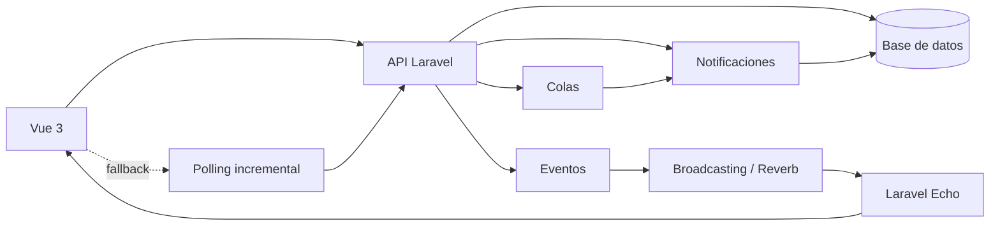

# Módulo de mensajería interna

## Descripción y arquitectura

`/mensajeria` es la bandeja institucional para usuarios autenticados y activos. Soporta conversaciones directas y grupales, comunicaciones formales, audiencia inmutable por mensaje, adjuntos privados, entrega, lectura y acuse explícito. No agrega tenant porque esta aplicación no posee uno.



El backend está separado en controladores API, Form Requests, políticas y servicios transaccionales bajo `app/Services/Messaging`. Los mensajes se guardan como texto plano. El frontend está en `resources/js/modules/messaging` y mantiene una caché limitada a las conversaciones abiertas durante la sesión; la base de datos siempre es la fuente oficial.

## Modelo de datos

- `conversations`: cabecera, ULID público, tipo, clave directa única, contexto polimórfico opcional y último mensaje.
- `conversation_participants`: propietario/administrador/integrante, bajas históricas y preferencias de archivo, fijado y silencio.
- `messages`: texto, comunicación formal, respuesta, prioridad, versión, SHA-256 y soft delete.
- `message_recipients`: fotografía inmutable de audiencia y estados individuales de entrega, lectura, acuse, exención y recordatorios.
- `message_versions`: historial de mensajes editables.
- `message_attachments`: metadatos privados, checksum y ULID de descarga.
- `message_mentions` y `message_reactions`: menciones y reacciones limitadas por configuración.
- `messaging_audit_events`: bitácora append-only; no existe endpoint para modificarla.
- `messaging_temporary_uploads`: cargas previas al envío, propiedad, caducidad y consumo único.

Todas las migraciones son reversibles. Las rutas exponen ULID, no las claves numéricas internas.

## Seguridad y permisos

Todo usuario autenticado y activo puede acceder, buscar usuarios, iniciar una conversación directa y escribir si su participación lo permite. Las políticas impiden leer conversaciones o descargar archivos ajenos. Una baja conserva el acceso histórico, pero no recibe destinatarios posteriores.

Permisos administrativos integrados al RBAC existente:

- `messaging.send_announcement`
- `messaging.view_receipts`
- `messaging.send_reminder`
- `messaging.waive_acknowledgement`
- `messaging.moderate`

`MessagingPermissionSeeder` los asigna únicamente a `super_admin`, `administrador` y `direccion`; no asigna privilegios administrativos a todos. El acceso básico no depende de un permiso.

Los archivos se almacenan en el disco privado configurado, se validan por extensión, MIME detectado y tamaño, se renombran aleatoriamente y se descargan solo por un endpoint autorizado con `nosniff`. No debe configurarse `MESSAGING_FILESYSTEM_DISK=public`.

## API

Base: `/api/messaging`, protegida por `auth:sanctum` y rate limits.

- `GET summary`, `GET config`, `GET users/search`, `GET search`
- `GET conversations`, `POST conversations/direct|group|announcement`, `GET|PATCH conversations/{ulid}`
- `POST|DELETE conversations/{ulid}/archive|pin|mute`, `POST|DELETE conversations/{ulid}/lock`
- `GET|POST conversations/{ulid}/participants`, `DELETE conversations/{ulid}/participants/{user}`
- `GET|POST conversations/{ulid}/messages`, `GET|PATCH|DELETE messages/{ulid}`
- `POST receipts/delivered`, `POST conversations/{ulid}/read`
- `POST messages/{ulid}/acknowledge`, `GET messages/{ulid}/receipts`
- `POST messages/{ulid}/reminders`, `POST messages/{ulid}/waivers`, `GET messages/{ulid}/receipt-export`
- `POST|DELETE messages/{ulid}/reactions/{reaction?}`
- `POST|DELETE uploads/{token?}`, `GET attachments/{ulid}`

El historial usa `before` y `since` con ULID, nunca número de página. Las búsquedas siempre parten de conversaciones visibles para el usuario.

## Acuse de recibo

Al enviar se activa `requires_acknowledgement`, se eligen destinatarios (vacío significa todos), plazo, comentario obligatorio y respuestas. El servidor calcula SHA-256 sobre una representación canónica con ULID, asunto, cuerpo, prioridad, versión, envío y checksums de adjuntos.

Abrir, entregar, leer, descargar o recibir por WebSocket jamás crea un acuse. `POST acknowledge` exige que el actor sea el destinatario histórico, bloquea suplantaciones y registra dentro de una transacción la hora de servidor, versión, hash, comentario, nombre snapshot, método explícito y auditoría. La operación es idempotente. Una comunicación con acuse no puede editarse.

Estados derivados: no solicitado, pendiente, acusado, vencido y eximido. El remitente consulta detalle y resumen en `receipts` y exporta CSV con el hash. Los recordatorios manuales respetan cooldown; el comando automático usa `last_reminded_at` y `reminder_count`.

La confirmación significa que el destinatario declara haber recibido y revisado la comunicación. No representa aceptación, conformidad ni firma electrónica.

## Tiempo real y fallback

El evento `MessageCreated` publica solo datos mínimos en `private-messaging.conversation.{publicId}`. `routes/channels.php` autoriza usuarios activos con participación histórica. Si `window.Echo` existe y el tiempo real está habilitado, el composable se suscribe y deduplica por `public_id`.

Siempre se mantiene polling incremental mediante `since`; si Echo/Reverb falla, la UI muestra “Sincronización periódica” sin exponer errores técnicos. El módulo funciona sin procesos persistentes.

Para habilitar Reverb en un VPS, instale/configure el broadcasting compatible con Laravel 12, exponga el proxy WebSocket con TLS, configure Echo en `resources/js/bootstrap.js` y ejecute el proceso con Supervisor:

```bash
php artisan reverb:start
```

Si Reverb no está instalado, mantenga `MESSAGING_REALTIME_ENABLED=false`; no es una dependencia de funcionamiento.

## Configuración

```dotenv
MESSAGING_ENABLED=true
MESSAGING_REALTIME_ENABLED=false
MESSAGING_POLL_INTERVAL_MS=5000
MESSAGING_EDIT_WINDOW_MINUTES=15
MESSAGING_MAX_MESSAGE_LENGTH=20000
MESSAGING_MAX_ATTACHMENT_MB=20
MESSAGING_MAX_ATTACHMENTS_PER_MESSAGE=10
MESSAGING_FILESYSTEM_DISK=local
MESSAGING_MANUAL_REMINDER_COOLDOWN_MINUTES=30
MESSAGING_ALLOW_ACK_AFTER_DUE_DATE=true
MESSAGING_ANNOUNCEMENT_CHUNK_SIZE=500
MESSAGING_ANNOUNCEMENT_CONFIRMATION_THRESHOLD=20
```

No toda la configuración se expone al navegador. Tipos de archivo y reacciones se cambian en `config/messaging.php`.

## Instalación y despliegue

```bash
php artisan migrate
php artisan db:seed --class=MessagingPermissionSeeder
php artisan optimize:clear
npm ci
npm run prod
php artisan queue:work --tries=3
```

Configure cron para Laravel Scheduler:

```cron
* * * * * cd /ruta/aplicacion && php artisan schedule:run >> /dev/null 2>&1
```

En cPanel/hosting compartido use `MESSAGING_REALTIME_ENABLED=false`, conserve el cron y use polling. Si no hay worker persistente, configure la cola `sync` o un cron acotado para `queue:work --stop-when-empty`; los mensajes y acuses siguen siendo síncronos y funcionales.

Tareas programadas:

```bash
php artisan messaging:send-acknowledgement-reminders
php artisan messaging:cleanup-temporary-uploads
```

## Pruebas

```bash
php artisan test --filter=MessagingModuleTest
npm run test:unit -- tests/frontend/messaging-api.test.js
npm run prod
php artisan route:list --path=api/messaging
```

Las pruebas cubren autenticación, visibilidad, conversación directa única, snapshot de audiencia, independencia lectura/acuse, idempotencia, comentario obligatorio, hash e inmutabilidad.

## Operación, respaldo y solución de problemas

Incluya todas las tablas `messaging_*`, `conversations`, `conversation_participants`, `messages`, `message_*` y el directorio privado `storage/app/.../messaging` en el mismo punto consistente de respaldo. Para restaurar, recupere primero la base y después los archivos preservando rutas y permisos.

- “No fue posible enviar”: revise logs, límite de carga, permisos del disco y estado de la conversación.
- Polling permanente: es normal sin Echo; verifique variables Vite/broadcasting y el proxy de Reverb si se esperaba WebSocket.
- Adjunto 404: confirme que el archivo exista en el disco privado y que el usuario participe en la conversación.
- Recordatorios ausentes: compruebe Scheduler, plazo, cooldown y que el destinatario siga pendiente.
- No registre cuerpos o archivos al depurar; use ULID y correlation ID.

Para desactivar temporalmente, establezca `MESSAGING_ENABLED=false`, retire/oculte el módulo desde navegación durante la ventana de mantenimiento y ejecute `php artisan config:cache`. No borre tablas ni archivos. Antes de una desinstalación permanente, exporte acuses y conserve auditoría según la política institucional.
