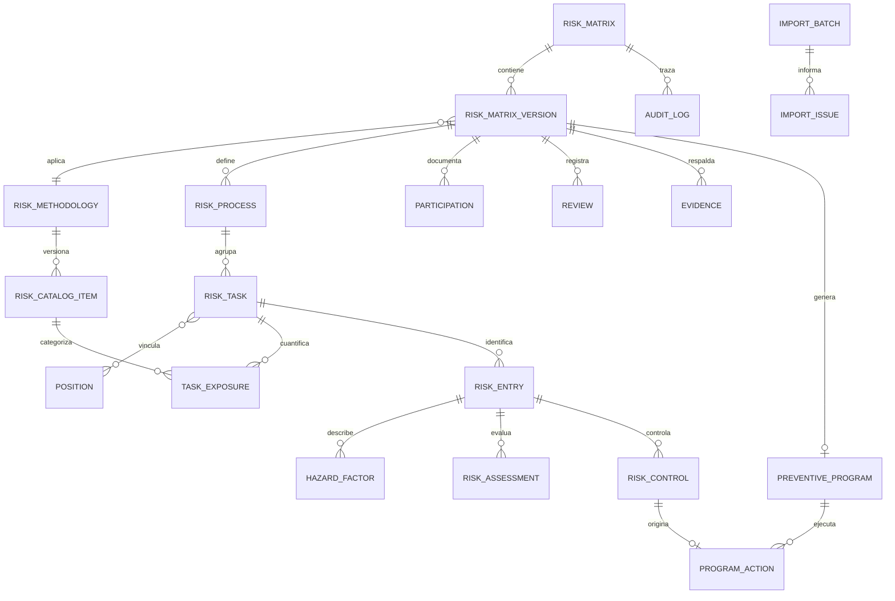
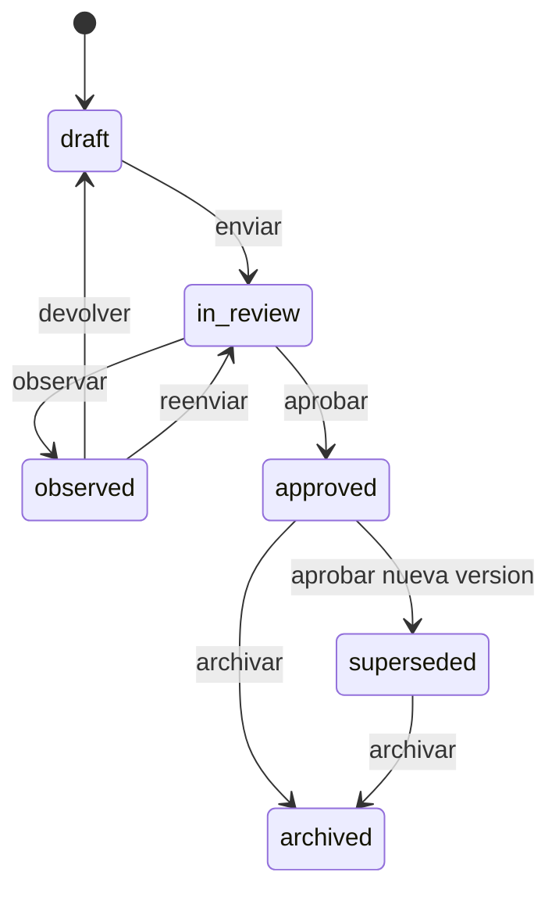

# Matriz IPER/MIPER y Programa de Trabajo Preventivo

## Descripción funcional

El módulo administra la identificación de peligros, evaluación de riesgos y medidas preventivas como un flujo institucional versionado. Permite crear matrices, registrar procesos, tareas, puestos, centros, exposición, peligros, evaluaciones VEP o específicas, controles, participación y evidencias; revisar y aprobar versiones inmutables; importar libros históricos; comparar versiones; y ejecutar el programa preventivo generado desde una aprobación.

La aprobación es una aprobación interna trazable. No se presenta como firma electrónica avanzada.

## Arquitectura integrada

- Backend: Laravel 12, PHP 8.2 o superior, Sanctum, Policies, Form Requests, Resources, notificaciones y scheduler existentes.
- Frontend: Vue 3, Vue Router, Bootstrap 5 y la identidad visual Skote existente.
- Autorización: roles, permisos, módulos y pivotes RBAC ya presentes.
- Personas y organización: `users`, `staff`, `cargos`, `departments` y `maintenance_dependencies`.
- Excel: `phpoffice/phpspreadsheet`, ya instalado en el proyecto.
- PDF: `pdfmake`, ya instalado y cargado de forma diferida en el frontend.
- Archivos: disco privado `local`; los archivos se sirven únicamente mediante endpoints autorizados.
- Alcance institucional: `company_key` y una instantánea de empresa. El proyecto no tenía una entidad consolidada de empresa, por lo que no se creó un segundo sistema organizacional paralelo.

El backend es la única fuente de verdad para VEP y clasificación. El frontend puede mostrar una previsualización, pero el valor persistido siempre se recalcula en `RiskAssessmentService` mediante `VepRiskCalculator`.

## Modelo de datos

Las tablas usan el prefijo `prevent_` y claves foráneas restrictivas para proteger el linaje aprobado.



Entidades principales:

- `prevent_risk_methodologies`: definición versionada del método.
- `prevent_risk_catalog_items`: catálogos con código estable, vigencia, configuración y metodología.
- `prevent_risk_matrices`: identidad estable de la matriz y versión activa.
- `prevent_risk_matrix_versions`: instantáneas institucionales, estado, control optimista, hash y snapshot de aprobación.
- `prevent_risk_matrix_processes`, `prevent_risk_matrix_tasks`, `prevent_risk_task_positions` y `prevent_risk_task_exposures`: estructura del trabajo y exposición.
- `prevent_risk_entries`, `prevent_risk_hazard_factors`, `prevent_risk_assessments` y `prevent_risk_controls`: núcleo técnico.
- `prevent_risk_evidences`, `prevent_risk_matrix_participations` y `prevent_risk_matrix_reviews`: respaldos y gobernanza.
- `prevent_preventive_programs` y `prevent_preventive_program_actions`: ejecución de medidas aprobadas.
- `prevent_risk_import_batches` y `prevent_risk_import_row_issues`: previsualización, normalizaciones y confirmación transaccional.
- `prevent_risk_audit_logs` y `prevent_risk_alert_logs`: auditoría y alertas idempotentes.

## Flujo de estados



- `draft` y `observed` son editables.
- `in_review` solo admite decisiones y constancias autorizadas; la estructura técnica no se edita.
- `approved`, `superseded` y `archived` son inmutables.
- Al aprobar se guarda `snapshot_hash`, `snapshot_payload`, responsable, fecha, vigencia y próxima revisión.
- Una nueva versión copia la estructura y el linaje, reinicia el seguimiento editable y no cambia la versión anterior.
- La versión anterior pasa a `superseded` solo cuando la nueva versión es aprobada.
- El campo `lock_version` produce HTTP 409 ante edición concurrente.

## Metodologías y VEP

La configuración inicial instala `ISP-2025-VEP`, versión 1.

```text
VEP = Probabilidad x Consecuencia
Probabilidad: 1, 2 o 4
Consecuencia: 1, 2 o 4
```

| VEP | Nivel | Regla operativa |
|---:|---|---|
| 1 o 2 | Tolerable | Mantener controles y verificar |
| 4 | Moderado | Planificar reducción |
| 8 | Importante | Exige medida, responsable y plazo |
| 16 | Intolerable | Bloquea aprobación ordinaria |

Una consecuencia 4 genera advertencia aun cuando VEP sea 4. Un riesgo intolerable puede llegar a revisión para registrar la decisión, pero solo puede aprobarse con `risk-matrix.override-block`, justificación y aprobación adicional expresa. El evento queda auditado.

Los riesgos no VEP usan `protocol`, `quantitative`, `qualitative` o `external_assessment`. Requieren fecha de instrumento y resultado o clasificación; pueden guardar protocolo, versión, valor, unidad, instrumento, evaluador y próxima medición. Las evaluaciones `current` y `residual` se conservan por separado.

## Controles y programa preventivo

Jerarquía: eliminación, sustitución, ingeniería, administrativos y EPP. Cada medida puede tener responsable, prioridad, inicio, vencimiento, periodicidad, estado, avance y evidencia.

Al aprobar una versión, `PreventiveProgramSynchronizer` crea o actualiza idempotentemente una acción por `risk_control_id`. No duplica acciones al repetir la sincronización. La ejecución actualiza control y acción en una transacción. La verificación exige evidencia y permiso específico.

## Permisos

| Permiso | Alcance |
|---|---|
| `risk-matrix.view` | Ver matrices autorizadas |
| `risk-matrix.create` | Crear matriz y versión inicial |
| `risk-matrix.update` | Editar borradores u observadas |
| `risk-matrix.delete-draft` | Eliminar únicamente un borrador sin historial |
| `risk-matrix.submit` | Enviar a revisión |
| `risk-matrix.review` | Validar técnicamente o devolver |
| `risk-matrix.observe` | Formular observaciones |
| `risk-matrix.approve` | Aprobar y bloquear |
| `risk-matrix.archive` | Archivar |
| `risk-matrix.create-version` | Crear nueva versión |
| `risk-matrix.import` | Analizar y confirmar Excel |
| `risk-matrix.export` | Exportar Excel y PDF autorizado |
| `risk-matrix.manage-catalogs` | Versionar catálogos y metodología |
| `risk-matrix.view-audit` | Consultar auditoría |
| `risk-matrix.override-block` | Resolver excepción intolerable documentada |
| `risk-control.create` | Crear medidas |
| `risk-control.update` | Modificar medidas editables |
| `risk-control.assign` | Asignar responsables |
| `risk-control.implement` | Registrar ejecución y evidencia |
| `risk-control.verify` | Verificar eficacia con evidencia |
| `preventive-program.view` | Ver programa preventivo |
| `preventive-program.manage` | Gestionar el programa |

Las Policies comprueban permiso, estado e institución. Los controladores de programa, estadísticas, importación, evidencia y auditoría vuelven a aplicar el alcance en backend. Ocultar un botón no concede ni reemplaza autorización.

La instalación RBAC es aditiva e idempotente. Otorga acceso completo a `super_admin`, `administrador` y `prevencion_riesgos` si esos roles existen, y acceso de lectura a roles institucionales configurados. No elimina permisos ni relaciones existentes.

## API

Prefijo: `/api/risk-prevention` bajo autenticación Sanctum.

- Matrices: `GET|POST /risk-matrices`, `GET|DELETE /risk-matrices/{matrix}`.
- Dashboard y catálogos: `GET /risk-matrices/dashboard`, `GET /risk-matrices/catalogs`.
- Catálogos: `POST /risk-matrices/catalogs/items`, `PATCH /risk-matrices/catalogs/items/{item}/status`.
- Metodología: `POST /risk-matrices/methodologies/versions`.
- Cálculo: `POST /risk-matrices/vep/calculate`.
- Versiones: `GET|POST /risk-matrices/{matrix}/versions`, `GET|PATCH /risk-matrix-versions/{version}`.
- Estructura y validación: `PUT /risk-matrix-versions/{version}/structure`, `GET /risk-matrix-versions/{version}/validation`.
- Flujo: `POST /risk-matrix-versions/{version}/{submit|review|observe|draft|approve|archive}`.
- Comparación: `GET /risk-matrix-versions/{version}/compare/{other}`.
- Participación y revisión: `POST /risk-matrix-versions/{version}/participations`, `POST /risk-matrix-versions/{version}/reviews`.
- Evidencia: `POST /risk-matrix-versions/{version}/evidences`, `GET /risk-evidences/{evidence}/download`.
- Importación: `GET /risk-matrices/imports`, `POST /risk-matrices/imports/preview`, `GET /risk-matrices/imports/{batch}`, `POST /risk-matrices/imports/{batch}/commit|cancel`.
- Exportación: `GET /risk-matrix-versions/{version}/export/xlsx`; `?format=historical` conserva columnas históricas.
- Auditoría: `GET /risk-matrices/{matrix}/audit`.
- Programa: `GET /preventive-programs`, `GET /preventive-programs/{program}`, `PATCH /preventive-program-actions/{action}`, `POST /preventive-program-actions/{action}/verify`.

## Rutas frontend

- `/risk-prevention/matrices`
- `/risk-prevention/matrices/nueva`
- `/risk-prevention/matrices/{id}/editar`
- `/risk-prevention/matrices/{id}`
- `/risk-prevention/matrices/{id}/versiones/{versionId}`
- `/risk-prevention/matrices/importaciones`
- `/risk-prevention/matrices/catalogos`
- `/risk-prevention/preventive-program`

El asistente tiene ocho pasos, guardado explícito, validación backend, navegación de errores y aviso de cambios pendientes. La grilla soporta búsqueda, columnas fijas, edición compacta, selección masiva, duplicación y altas. Las vistas de detalle, comparación, auditoría y programa son responsivas.

## Importación Excel

La previsualización:

1. valida extensión, MIME, tamaño y seguridad del ZIP;
2. guarda el archivo en almacenamiento privado con nombre SHA-256;
3. detecta hojas y encabezados dinámicamente;
4. normaliza textos, `Rutinaria/No rutinaria`, jerarquía, periodicidad y booleanos como `Si`, `SI`, `No` y `NO`;
5. acepta representaciones heredadas como `Baja (2)` conservando una advertencia si etiqueta y número difieren;
6. recalcula VEP y clasificación sin confiar en fórmulas, magnitud ni clasificación del libro;
7. informa errores, advertencias y posibles duplicados por fila;
8. no escribe procesos, tareas ni riesgos hasta la confirmación.

La confirmación ocurre en una transacción y puede crear una matriz, reemplazar la estructura de un borrador o crear una versión si el destino ya está aprobado. Un hash previamente confirmado exige aceptación explícita. Dos hojas de criterios no crean catálogos duplicados.

Fixture anonimizado: `tests/Fixtures/matriz-iper-anonimizada.xlsx`. Se regenera con:

```bash
php tests/Fixtures/generate_anonymized_risk_matrix.php
```

El fixture no contiene nombres, RUT, correos ni datos reales.

## Exportación

- Excel moderno: incluye identidad, versión, procesos, exposición, evaluación actual/residual, controles, responsables, estado y hash.
- Excel histórico: conserva el orden de columnas compatible con el libro heredado.
- Hojas adicionales: criterios metodológicos y programa de trabajo.
- Las celdas que comienzan con `=`, `+`, `-` o `@` se neutralizan para impedir inyección de fórmulas.
- PDF ejecutivo: se genera con pdfmake, repite encabezados de tabla, incluye metodología, firmas internas, indicadores, matriz y programa; está preparado para descarga e impresión.

## Auditoría, notificaciones y jobs

La auditoría registra usuario, fecha, IP, agente, entidad, acción, valores anteriores/nuevos saneados y fundamento. No registra rutas privadas ni snapshots completos en los cambios. El historial reúne matriz, versiones, controles e importaciones confirmadas.

Comando:

```bash
php artisan risk-matrices:send-reminders
```

Se ejecuta diariamente a las 07:15, sin solapamiento y en un solo servidor. Notifica hitos de 15, 7, 3 y 0 días, vencimientos, preparación del programa y revisión anual. `prevent_risk_alert_logs.alert_key` impide alertas duplicadas.

El cron del servidor debe ejecutar el scheduler de Laravel cada minuto.

## Configuración

Variables opcionales:

```dotenv
RISK_MATRIX_COMPANY_KEY=institution
RISK_MATRIX_COMPANY_NAME="Institución"
RISK_MATRIX_COMPANY_TAX_ID=
RISK_MATRIX_COMPANY_ADDRESS=
RISK_MATRIX_ECONOMIC_ACTIVITY_CODE=
RISK_MATRIX_METHODOLOGY=ISP-2025-VEP
RISK_MATRIX_PROGRAM_DUE_DAYS=30
RISK_MATRIX_REVIEW_MONTHS=12
RISK_MATRIX_IMPORT_MAX_KB=20480
RISK_MATRIX_IMPORT_PREVIEW_ROWS=50
RISK_MATRIX_IMPORT_MAX_ROWS=10000
RISK_MATRIX_EVIDENCE_MAX_KB=20480
```

No se agregaron dependencias. PhpSpreadsheet y pdfmake ya estaban instalados.

## Pruebas y validación local

```bash
php artisan test tests/Unit/RiskPrevention/VepRiskCalculatorTest.php
php artisan test tests/Feature/RiskPrevention/RiskMatrixWorkflowTest.php
php artisan test tests/Feature/RiskPrevention/RiskMatrixImportTest.php
npm run test:unit -- tests/frontend/risk-matrix-ui.test.js
npm run prod
```

Para validar migraciones sin tocar la base configurada, use una SQLite temporal explícita:

```bash
touch /tmp/iper-validation.sqlite
DB_CONNECTION=sqlite DB_DATABASE=/tmp/iper-validation.sqlite APP_ENV=testing php artisan migrate --force --no-interaction
```

## Despliegue seguro

Nunca ejecutar `migrate:fresh`, `db:wipe`, restauraciones destructivas ni rollback de tablas IPER en producción.

1. Poner el despliegue en ventana controlada y comprobar conexión/entorno.
2. Crear primero un respaldo sin poda y verificar que el comando termine correctamente:

```bash
php artisan backup:database --no-prune
```

3. Revisar SQL planificado y confirmar que solo se crean tablas, índices, catálogos y permisos del módulo:

```bash
php artisan migrate --pretend --force
```

4. Ejecutar migraciones y configuración aditiva:

```bash
php artisan migrate --force --isolated
php artisan db:seed --class=RiskMatrixModuleSeeder --force
php artisan rbac:audit --strict
```

5. Compilar los assets con `npm run prod`, limpiar caché de aplicación de forma controlada y comprobar rutas, permisos y scheduler.
6. Comparar antes/después: cantidad de usuarios, roles y registros operacionales existentes; las únicas altas esperadas son tablas, permisos, módulos y catálogos IPER.
7. Conservar el respaldo y el resultado del `rbac:audit` junto con la evidencia del despliegue.

Las dos migraciones son forward-only. `down()` no elimina matrices, evaluaciones, evidencias, auditoría ni configuración, incluso si alguien intenta un rollback accidental.

## Privacidad y seguridad

- Los archivos históricos y evidencias se guardan en disco privado.
- Las descargas pasan por autorización y usan `Cache-Control: no-store, private`.
- Los listados, estadísticas, importaciones, programa, recordatorios y Policies filtran por `company_key`.
- Los archivos adjuntos se tratan como datos; nunca como instrucciones ejecutables.
- El importer limita filas, tamaño y relación de compresión.
- El backend prohíbe enviar `calculated_score` o `calculated_level_id`.
- Aprobaciones, excepciones, verificaciones, descargas e importaciones dejan traza.
- Factories y fixture usan datos ficticios.

## Actualizar catálogos sin alterar historia

No edite ni elimine un elemento usado por una matriz aprobada. Para un cambio menor, cierre su vigencia con `valid_until` y cree un nuevo código. Para un cambio metodológico:

1. use el endpoint de nueva versión metodológica;
2. indique vigencia y configuración;
3. revise los catálogos clonados;
4. active nuevos códigos y desactive los anteriores sin borrarlos;
5. cree una nueva versión de matriz para adoptar el método.

Cada versión de matriz conserva `methodology_id` y los IDs de catálogo históricos.

## Agregar otra metodología

1. Crear una versión en `prevent_risk_methodologies` con código, vigencia y configuración.
2. Crear sus catálogos de niveles, métodos, protocolos y reglas.
3. Implementar un calculador backend separado si no corresponde a VEP.
4. Enrutar la creación de evaluaciones por `method` sin aceptar resultados calculados por el cliente.
5. Agregar validación, exportación y pruebas unitarias de todas las combinaciones.
6. No modificar evaluaciones ni snapshots aprobados existentes.

## Decisiones y limitaciones conocidas

- Empresa: al no existir una entidad única, se usa configuración institucional más snapshot. Si el proyecto incorpora multiempresa nativa, `company_key` debe migrarse de forma aditiva a su clave foránea y conservar la instantánea.
- Centro de trabajo: se reutiliza `maintenance_dependencies` porque es el catálogo activo equivalente.
- El archivo histórico real no fue incorporado al repositorio. El parser es tolerante a encabezados y hojas, y se validó con un libro anonimizado. Antes del despliegue se debe hacer una previsualización del libro institucional real y resolver sus advertencias sin publicar datos personales.
- La representación legal y la aprobación son registros internos, no firma electrónica avanzada.
- Los archivos de gran tamaño se procesan con límite configurable de filas; para volúmenes que excedan el umbral institucional se recomienda ejecutar la importación en una cola supervisada en una versión futura.
